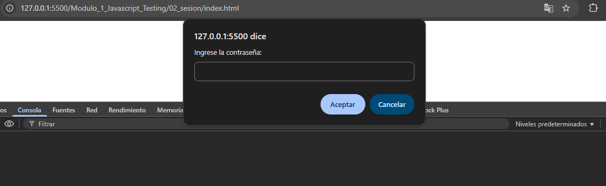
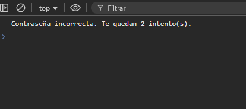
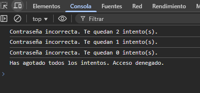
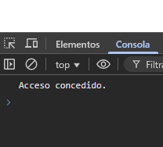

# JavaScript Testing - Módulo 1

# Archivo `actividad_2.js`

Este archivo contiene una actividad contemplando lo visto en la clase 2

## Objetivos 

- Condicionales, Bucles e iteración en JavaScript

## Procedimiento seguido

1. **Análisis del problema**  
   Comprender las condicionales y bucles en JavaScript

2. **Implementación del código**  
    Se realizo un codigo simulando una validacion de contraseña con reintentos

## Problemas encontrados y soluciones implementadas

- Sin problemas

## Capturas de pantalla o diagramas relevantes

A continuación, se incluyen capturas de pantalla que ilustran el funcionamiento del archivo `actividad_2.js`:

  
*Figura 1: Capturando dato de entrada en promp.*
  
*Figura 2: Si no se ingreso la contraseña correcta.*
  
*Figura 3: Intentos agotados.*
  
*Figura 4: Se ingreso la contraseña correcta.*

## Referencias o recursos utilizados

- [Documentación oficial de JavaScript - Bucles e Iteraciones](https://developer.mozilla.org/es/docs/Web/JavaScript/Guide/Loops_and_iteration)
- [Documentación oficial de JavaScript - Condicionales](https://developer.mozilla.org/es/docs/Learn_web_development/Core/Scripting/Conditionals)

