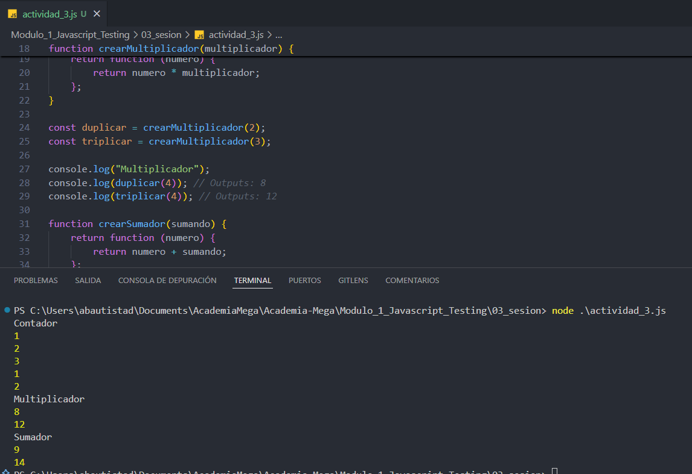

# JavaScript Testing - Módulo 1

# Archivo `actividad_3.js`

Este archivo contiene una actividad contemplando lo visto en la clase 3

## Objetivos 

- Funciones Closures

## Procedimiento seguido

1. **Análisis del problema**  
   Comprender las funciones closures en JavaScript

2. **Implementación del código**  
    Se realizo un codigo implementando varias funciones closures

## Problemas encontrados y soluciones implementadas

- Sin problemas

## Capturas de pantalla o diagramas relevantes

A continuación, se incluyen capturas de pantalla que ilustran el funcionamiento del archivo `actividad_3.js`:

  
*Figura 1: Resultados.*

## Referencias o recursos utilizados

- [Documentación oficial de JavaScript - Closures](https://developer.mozilla.org/es/docs/Web/JavaScript/Guide/Closures)
