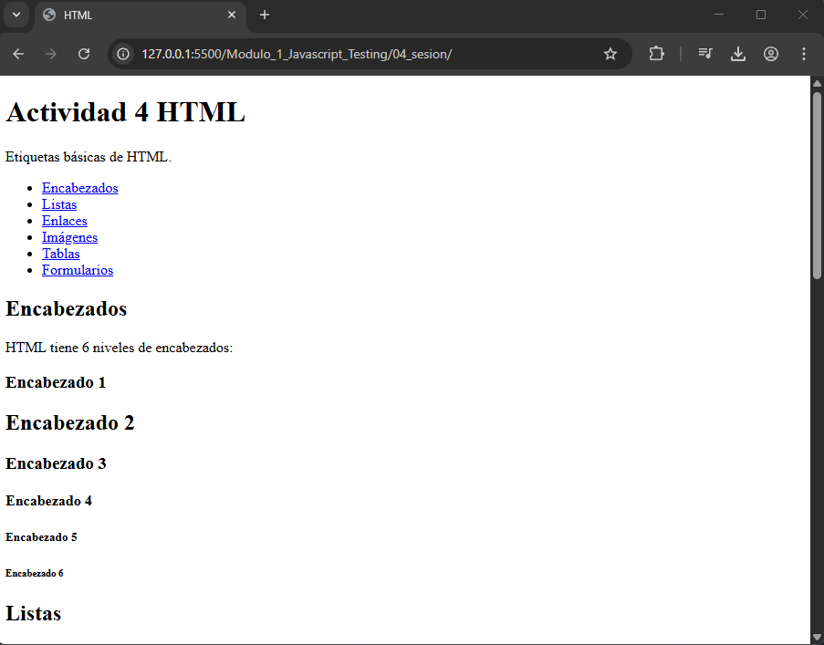
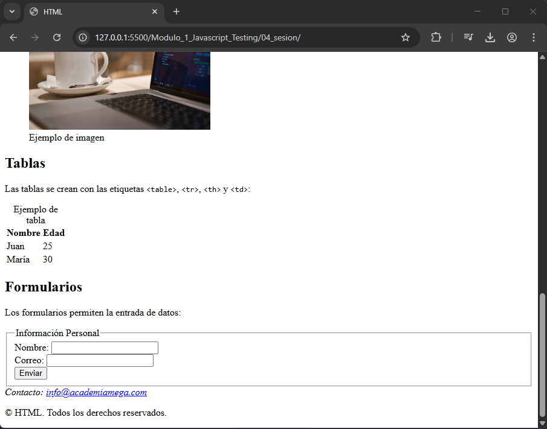

# JavaScript Testing - Módulo 1

# Archivo `index.html`

Este archivo contiene una actividad contemplando lo visto en la clase 4

## Objetivos 

- HTML, etiquetas basicas, estructura. 

## Procedimiento seguido

1. **Análisis del problema**  
   Comprender HTML, el uso de etiquetas, estructura, etc..

2. **Implementación del código**  
    Se creo un archivo index.html implementando las etiquetas basicas de HTML

## Problemas encontrados y soluciones implementadas

- Sin problemas

## Capturas de pantalla o diagramas relevantes

A continuación, se incluyen capturas de pantalla que ilustran el funcionamiento del archivo `index.html`:

  
*Figura 1: Captura de la pagina.*

  
*Figura 2: Captura de la pagina.*

## Referencias o recursos utilizados

- [Documentación oficial de HTML](https://developer.mozilla.org/es/docs/Web/HTML)
