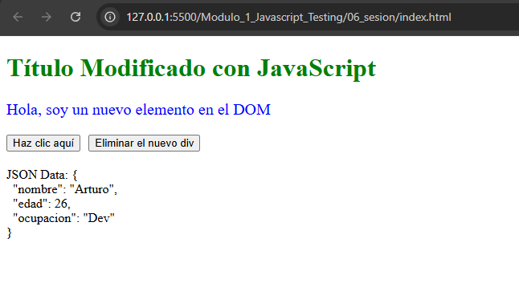
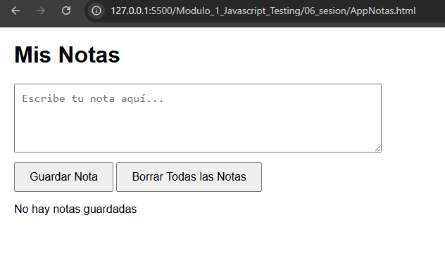
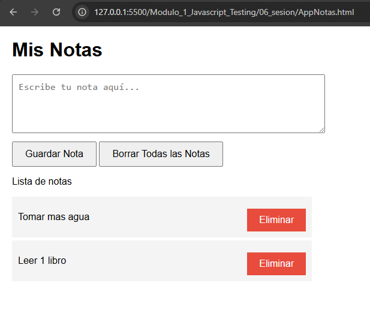

# JavaScript Testing - Módulo 1

# Archivos `DOMyJSON.html`, `manipuladoDOMyJSON.js` , `AppNotas.html` , `app_notas.js`

Este archivo contiene las actividades contemplando lo visto en la clase 6

## Objetivos 

- Manipulando el DOM y JSON
- Crear una aplicacion de notas

## Procedimiento seguido

1. **Análisis del problema**  
   - Comprender como funciona el DOM y los JSON
   - Crear una aplicacion de notas usando el localstorage

2. **Implementación del código**  
    Se crearon varios archivos para comprender lo aprendido

## Problemas encontrados y soluciones implementadas

- Sin problemas

## Capturas de pantalla o diagramas relevantes

A continuación, se incluyen capturas de pantalla que ilustran el funcionamiento de las actividades

  
*Figura 1: Captura de la actividad Manipulando el DOM y JSON.*

  
*Figura 2: Captura de la aplicacion de notas.*

  
*Figura 2: Captura de la aplicacion de notas.*

## Referencias o recursos utilizados

- [Documentación oficial de DOM](https://developer.mozilla.org/es/docs/Glossary/DOM)
- [Documentación oficial de JSON](https://developer.mozilla.org/es/docs/Web/JavaScript/Reference/Global_Objects/JSON)
- [Documentación oficial de LocalStorage](https://developer.mozilla.org/es/docs/Web/API/Window/localStorage)