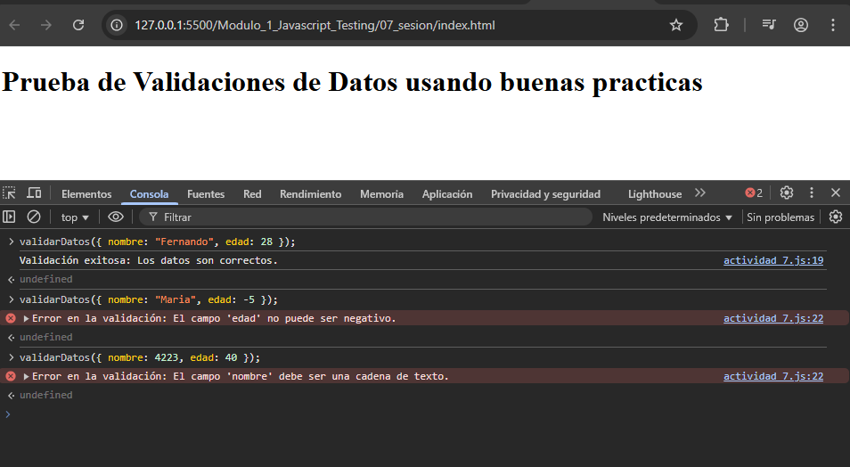

# JavaScript Testing - Módulo 1

# Archivo `actividad_7.js`

Este archivo contiene una actividad contemplando lo visto en la clase 7

## Objetivos 

- Implementar buenas practivas en JavaScript

## Procedimiento seguido

1. **Análisis del problema**  
   Uso de bloques de control de errores como try catch

2. **Implementación del código**  
    Se creo el archivo actividad_7.js implementando try catch

## Problemas encontrados y soluciones implementadas

- Sin problemas

## Capturas de pantalla o diagramas relevantes

A continuación, se incluyen capturas de pantalla que ilustran el funcionamiento de la actividad

  
*Figura 1: Captura de la actividad.*

## Referencias o recursos utilizados

- [Documentación oficial de try...catch](https://developer.mozilla.org/en-US/docs/Web/JavaScript/Reference/Statements/try...catch)
