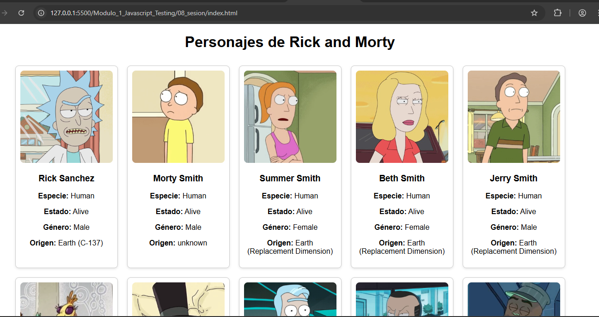
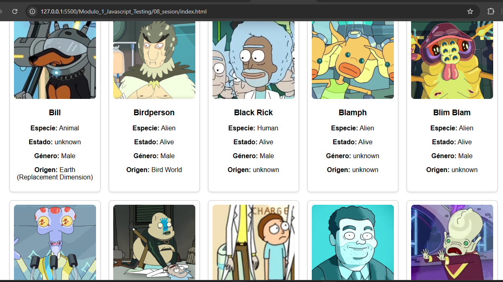

# JavaScript Testing - Módulo 1

# Archivos `actividad_8.js`

Este archivo contiene las actividades contemplando lo visto en la clase 8

## Objetivos 

- Promesas, metodos asincronos, consultas a un API

## Procedimiento seguido

1. **Análisis del problema**  
   - Comprender como funcionan las promesas, implementar metodos asincronos consultando informacion a un API

2. **Implementación del código**  
    Se creo un archivo con codigo javascript usando metodos asincronos

## Problemas encontrados y soluciones implementadas

- Sin problemas

## Capturas de pantalla o diagramas relevantes

A continuación, se incluyen capturas de pantalla que ilustran el funcionamiento de las actividades

  
*Figura 1: Captura de la actividad.*

  
*Figura 2: Captura de la aplicacion de notas.*

## Referencias o recursos utilizados

- [Documentación oficial de async function](https://developer.mozilla.org/en-US/docs/Web/JavaScript/Reference/Statements/async_function)