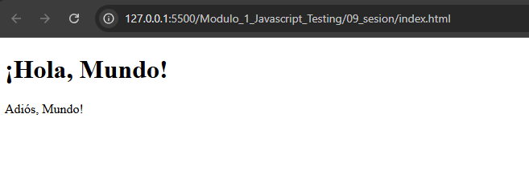

# JavaScript Testing - Módulo 1

# Archivos `main.js` , `utils.js`

Este archivo contiene las actividades contemplando lo visto en la clase 9

## Objetivos 

- Modulos JavaScript

## Procedimiento seguido

1. **Análisis del problema**  
   - La idea es separar la lógica en archivos distintos para reutilizar funciones y mantener un código organizado.

2. **Implementación del código**  
    Se crearon dos archivos js uno donde se exportan unas funciones y otro donde se importan

## Problemas encontrados y soluciones implementadas

- Sin problemas

## Capturas de pantalla o diagramas relevantes

A continuación, se incluyen capturas de pantalla que ilustran el funcionamiento de las actividades

  
*Figura 1: Captura de la actividad.*

## Referencias o recursos utilizados

- [Documentación oficial de modulos](https://developer.mozilla.org/es/docs/Web/JavaScript/Guide/Modules)