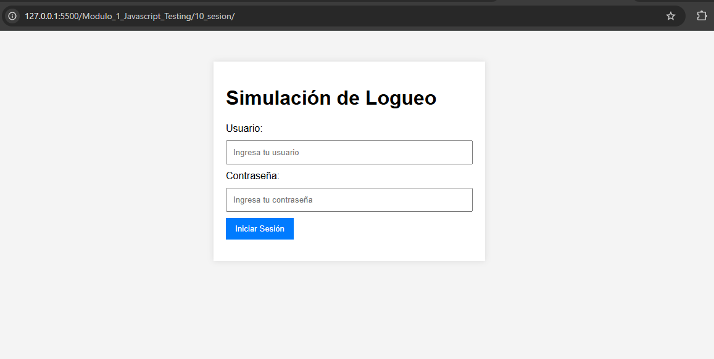

# JavaScript Testing - Módulo 1

# Archivos `app.js` , `authModule.js` , `userSession.js`

Este archivo contiene las actividades contemplando lo visto en la clase 10

## Objetivos 

- Patrones de diseño "Módulo y Singleton"

## Procedimiento seguido

1. **Análisis del problema**  
   -  Implementar dos patrones de diseño muy comunes: el Módulo y el Singleton

2. **Implementación del código**  
    Se crearon archivos js para implementar los patrones de diseño

## Problemas encontrados y soluciones implementadas

- Sin problemas

## Capturas de pantalla o diagramas relevantes

A continuación, se incluyen capturas de pantalla que ilustran el funcionamiento de las actividades

  
*Figura 1: Login.*

  
*Figura 1: Cerrar sesión.*

## Referencias o recursos utilizados

- [Patron de diseño Módulo](https://www.chucksacademy.com/es/topic/javascript-design-patterns/module-pattern)

- [Patron de diseño Singleton](https://www.chucksacademy.com/es/topic/javascript-design-patterns/singleton-pattern)
