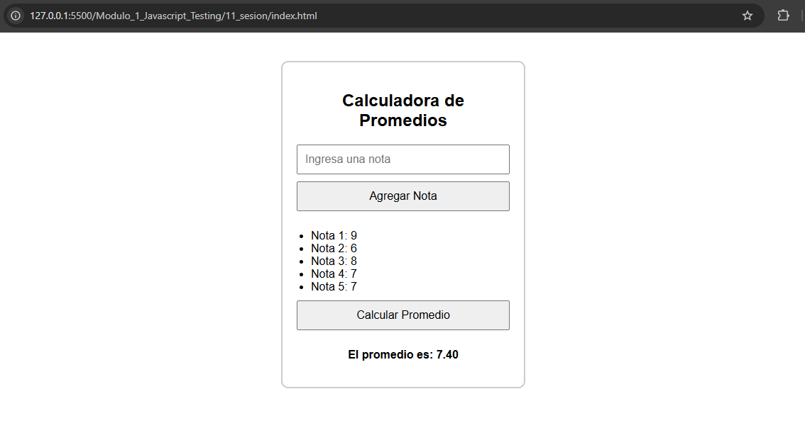
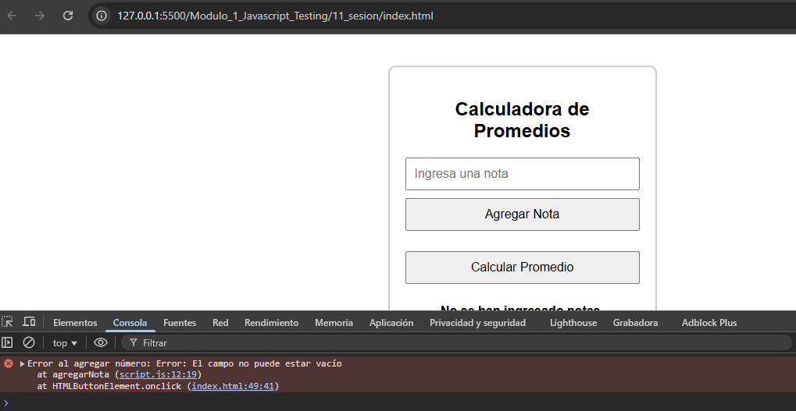
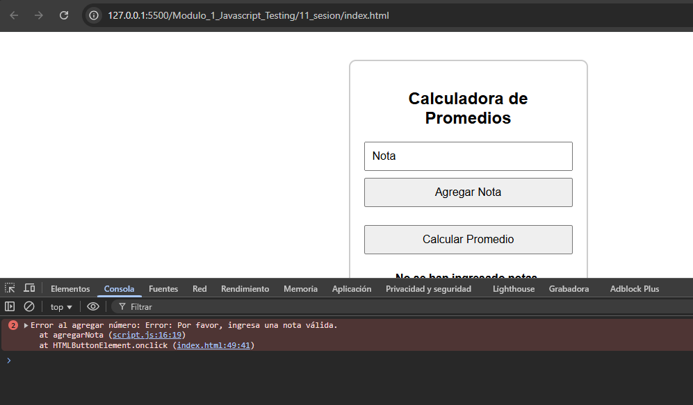

# JavaScript Testing - Módulo 1

# Archivos `script.js`

Este archivo contiene las actividades contemplando lo visto en la clase 11

## Objetivos 

- Introducción al Testing

## Procedimiento seguido

1. **Análisis del problema**  
   -  Validaciones durante el proceso de testing

2. **Implementación del código**  
    Se creo un archivo js donde se simulo una calculadora de notas y se implementaron validaciones a los datos de entrada

## Problemas encontrados y soluciones implementadas

- Sin problemas

## Capturas de pantalla o diagramas relevantes

A continuación, se incluyen capturas de pantalla que ilustran el funcionamiento de las actividades

  
*Figura 1: Calculadora de promedios.*

  
*Figura 2: Error al validar -> no se introdujo ningun valor en el input.*

  
*Figura 3: Error al validar -> el tipo de dato en el input debe ser numerico.*

## Referencias o recursos utilizados

- [Testing con javascript](https://www.baumannzone.dev/blog/testing-con-javascript)
