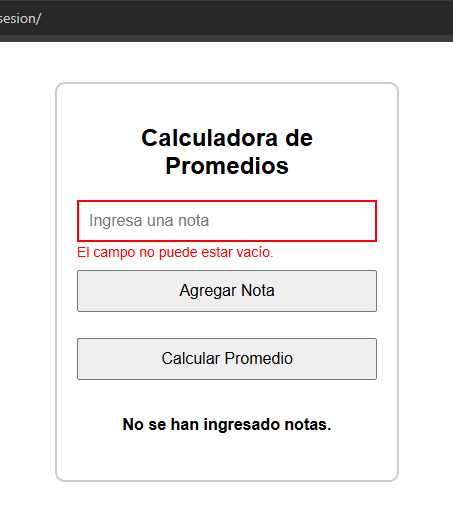
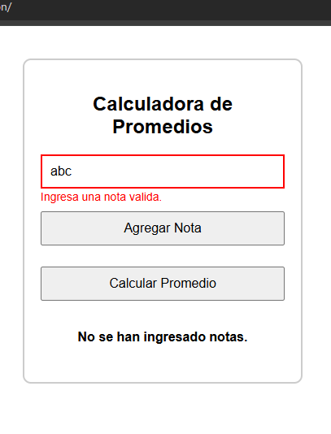
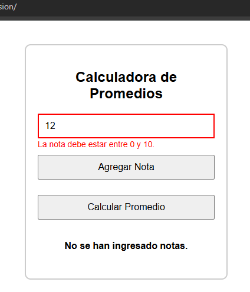
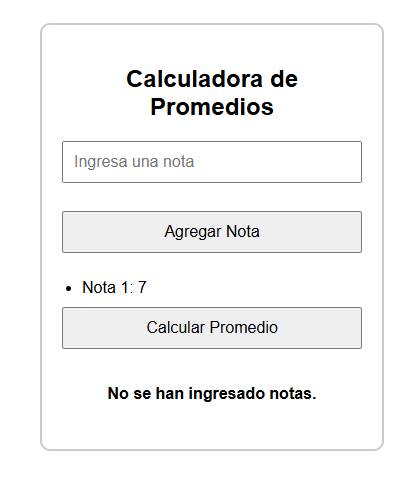
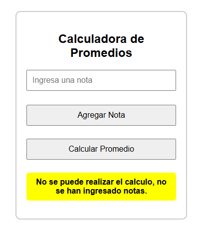

# JavaScript Testing - Módulo 1

# Archivos `Casos de Pruebas.pdf`

Este archivo contiene las actividades contemplando lo visto en la clase 12

## Objetivos 

- Proceso de Testing

## Procedimiento seguido

1. **Análisis del problema**  
   -  Ejecutar un proceso de testing con casos de pruebas

2. **Implementación del código**  
   -  Se creo un archivo pdf detallando los casos de pruebas realizados

## Problemas encontrados y soluciones implementadas

- Sin problemas

## Capturas de pantalla o diagramas relevantes

A continuación, se incluyen capturas de pantalla que ilustran el funcionamiento de las actividades

  
*Figura 1: Entrada vacia.*

  
*Figura 2: Entrada no numerica.*

  
*Figura 3: Nota fuera del rango.*

  
*Figura 3: Nota valida.*

  
*Figura 3: Calcular promedio con lista vacía.*

## Referencias o recursos utilizados

