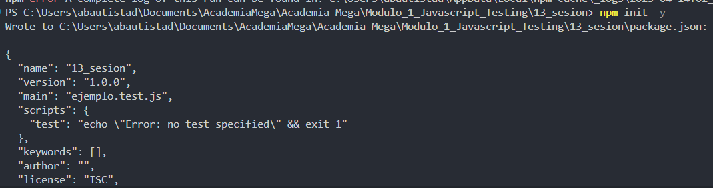
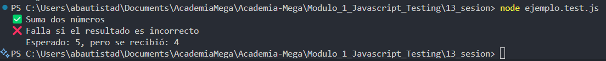

# JavaScript Testing - Módulo 1

# Archivos `ejemplo.test.js` , `test.miniframework.js` , `package.json`

Este archivo contiene una actividad contemplando lo visto en la clase 13

## Objetivos 

- Crear un framework para testing con JavaScript

## Procedimiento seguido

1. **Análisis del problema**  
   -  Ejecutar un proceso de testing creando un pequeño framework

2. **Implementación del código**  
   -  Se crearon 3 archivos para llevar a cabo la actividad de crear un framework para testing en javascript
   -  Paso 1: Inicializar el proyecto -> Se ejecuto el siguiente comando en la terminal para inicializar con el proyecto "npm init -y"
   -  Paso 2: Creamos el archivo "test-miniframework.js" el cual es el core del mini framework que se realizo, contiene las funciones que permiten definir y ejecutar las pruebas
   -  Paso 3: Creamos el archivo "ejemplo.test.js" el cual contiene las pruebas que realizaremos usando las funciones del mini framework

3.- **Pruebas**  
   - Para ejecutar las pruebas del miniframework que hemos realizado escribimos el comando "node ejemplo.test.js"

## Problemas encontrados y soluciones implementadas

- Sin problemas

## Capturas de pantalla o diagramas relevantes

A continuación, se incluyen capturas de pantalla que ilustran el funcionamiento de las actividades

  
*Figura 1: Inicializamos el proyecto .*

  
*Figura 2: Ejecutamos las pruebas del miniframework.*

## Referencias o recursos utilizados

- [Testing con Javascript](https://www.baumannzone.dev/blog/testing-con-javascript)

- [Pruebas unitarias de JavaScript y TypeScript en Visual Studio](https://learn.microsoft.com/es-es/visualstudio/javascript/unit-testing-javascript-with-visual-studio?view=vs-2022&tabs=jest)
