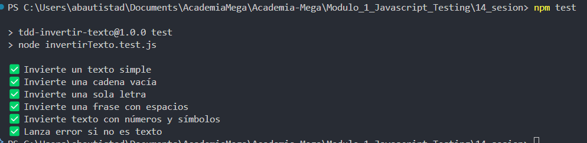
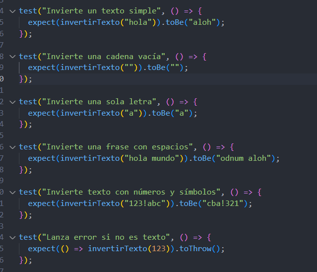

# JavaScript Testing - Módulo 1

# Archivos `invertirTexto.js`  `invertirTexto.test.js` , `test.framework.js` , `package.json`

Este archivo contiene una actividad contemplando lo visto en la clase 14

## Objetivos 

- Introducción al TDD

## Procedimiento seguido

1. **Análisis del problema**  
   -  Implementar TDD

2. **Implementación del código**  
   -  Se crearon 5 archivos para llevar a cabo la actividad de implementar TDD 
   -  Paso 1: Inicializar el proyecto -> Se ejecuto el siguiente comando en la terminal para inicializar con el proyecto "npm init -y"
   -  Paso 2: Creamos el archivo "test-framework.js" el cual es el core del framework que se realizo, contiene las funciones que permiten definir y ejecutar las pruebas
   -  Paso 3: Creamos el archivo "invertirTexto.js" el cual contiene la funcion para invertir un texto que recibe
   -  Paso 4: Creamos el archivo "invertirTexto.test.js" el cual contiene las pruebas que realizaremos 
   -  Paso 5: Modificamos el archivo package.json donde dice "test" de la siguiente forma "test": "node invertirTexto.test.js" para correr las pruebas ejecutando el comando "npm test"

3.- **Pruebas**  
   - Para ejecutar las pruebas de la implementacion TDD que hemos realizado escribimos el comando "npm test"

## Problemas encontrados y soluciones implementadas

- Sin problemas

## Capturas de pantalla o diagramas relevantes

A continuación, se incluyen capturas de pantalla que ilustran el funcionamiento de las actividades

  
*Figura 1: Ejecutando pruebas .*

  
*Figura 2: Pruebas que se realizaron.*

## Referencias o recursos utilizados

- [TDD Sencillo](https://dev.to/dragosb/tdd-sencillo-2c9n)

- [Test-Driven Development Tutorial – How to Test Your JavaScript](https://www.freecodecamp.org/news/test-driven-development-tutorial-how-to-test-javascript-and-reactjs-app/)
