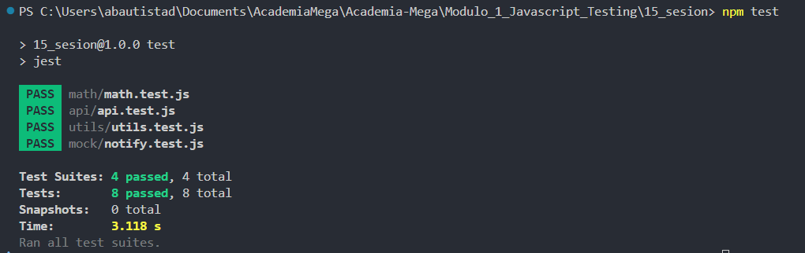

# JavaScript Testing - Módulo 1

# Carpetas con los archivos implementando pruebas con Jest -> `math`  `mock` , `utils` , `api`

Este archivo contiene una actividad contemplando lo visto en la clase 15

## Objetivos 

- Introducción a Jest

## Procedimiento seguido

1. **Análisis del problema**  
   -  Realizar pruebas de testing utilizando Jest

2. **Implementación del código**  
   -  Se crearon varios archivos que implementan pruebas utilizando el framework de Jest
   -  Paso 1: Inicializar el proyecto -> Se ejecuto el siguiente comando en la terminal para inicializar con el proyecto "npm init -y"
   -  Paso 2: Instalar Jest, en la terminal ejecutamos el comando "npm install --save-dev jest"
   -  Paso 3: Modificamos el archivo package.json donde dice "test" de la siguiente forma "test": "jest" para correr las pruebas ejecutando el comando "npm test"
   -  Paso 4: Creamos los archivos javascript para implementar las pruebas con Jest

3.- **Pruebas**  
   - Para ejecutar las pruebas de la implementacion con Jest que hemos realizado escribimos el comando "npm test"

## Problemas encontrados y soluciones implementadas

- Sin problemas

## Capturas de pantalla o diagramas relevantes

A continuación, se incluyen capturas de pantalla que ilustran el funcionamiento de las actividades

  
*Figura 1: Ejecutando pruebas .*

## Referencias o recursos utilizados

- [Jest](https://jestjs.io/docs/getting-started)

- [NPM Jest](https://www.npmjs.com/package/jest)

- [Testing JavaScript with Jest on Vultr](https://developer.mozilla.org/en-US/blog/test-javascript-with-jest-on-vultr/)
