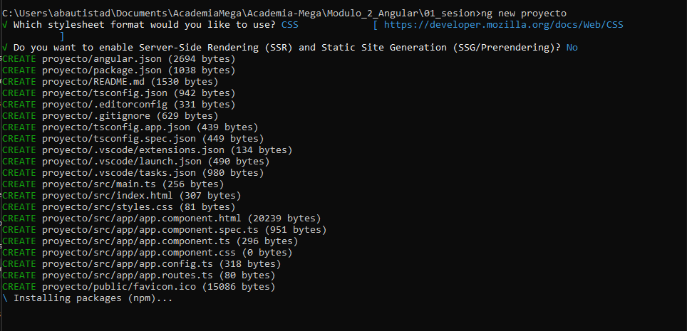
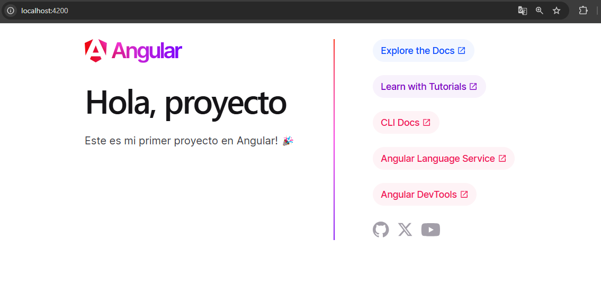

# Angular - Módulo 2

# Proyecto 

Este archivo contiene una actividad contemplando lo visto en la clase 1

## Objetivos 

- Introducción a Angular

## Procedimiento seguido

1. **Análisis del problema**  
   -  Conocer el framework Angular

2. **Instalacion**  
   -  Instalar el Framework
   ```sh
    npm install -g @angular/cli
   ```
   -  Crear un nuevo proyecto
   ```sh
    ng new <project-name>
   ```  

3.- **Ejecutar Proyecto**  
   -  Nos colocaremos en la carpeta del proyecto
   ```sh
    cd my-first-angular-app
   ```  
   - Iniciar el proyecto
   ```sh
    npm start
   ```  
   
## Problemas encontrados y soluciones implementadas

- Sin problemas

## Capturas de pantalla o diagramas relevantes

A continuación, se incluyen capturas de pantalla que ilustran el funcionamiento de las actividades

  
*Figura 1: Instalando Angular .*

  
*Figura 2: Proyecto de Angular .*
## Referencias o recursos utilizados

- [Angular](https://angular.dev/)
