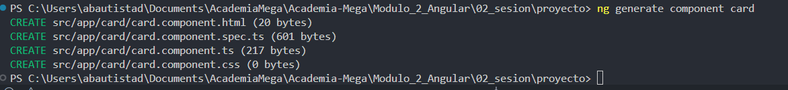
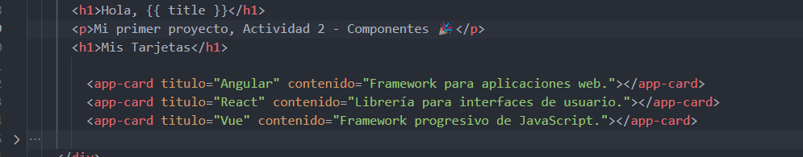
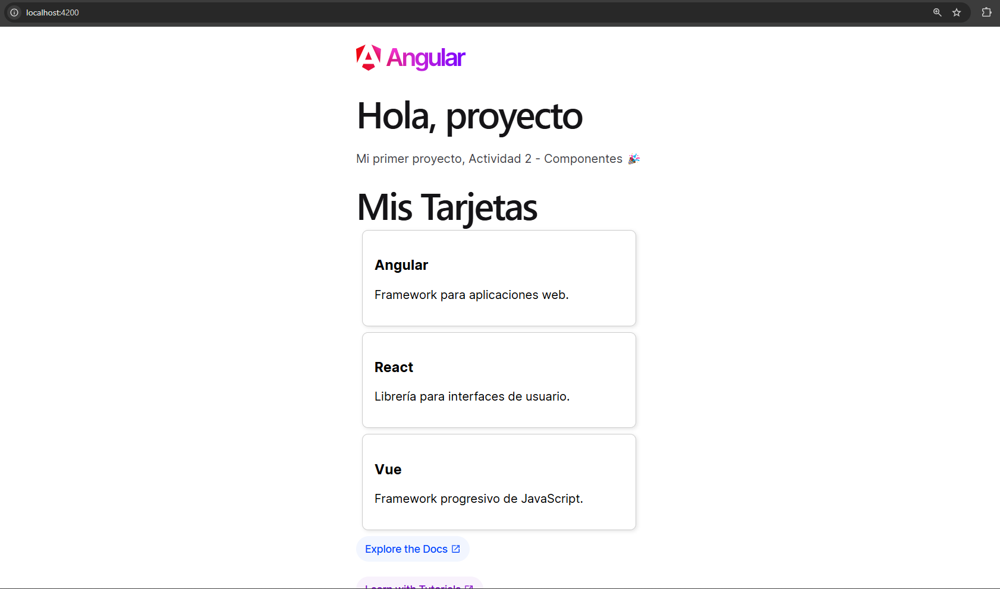

# Angular - Módulo 2

# Proyecto 

Este archivo contiene una actividad contemplando lo visto en la clase 2

## Objetivos 

- Introducción a Angular - Componentes

## Procedimiento seguido

1. **Análisis del problema**  
   -  Crear un nuevo componente e integrarlo correctamente

2. **Codigo**  
   -  En nuestro proyecto debemos abrir la terminal y ejecutar el siguiente comando
   ```sh
    ng generate component <nombre-componente>
   ```
   - Esto generara un nuevo componente de angular con los archivos html, css y ts listos modificarlos

3.- **Implementacion**  
   - Una vez modificado el componente que creamos lo agregamos al app.component.html
   - Iniciamos el proyecto
   ```sh
    ng serve
   ```  
   
## Problemas encontrados y soluciones implementadas

- Sin problemas

## Capturas de pantalla o diagramas relevantes

A continuación, se incluyen capturas de pantalla que ilustran el funcionamiento de las actividades

  
*Figura 1: Instalando componente .*

  
*Figura 1: implementando componente .*

  
*Figura 2: Aplicacion con el componente implementado .*

## Referencias o recursos utilizados

- [Anatomy of a component](https://angular.dev/guide/components)
