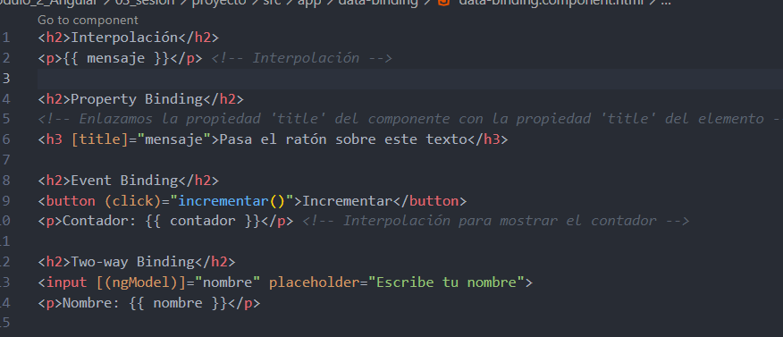
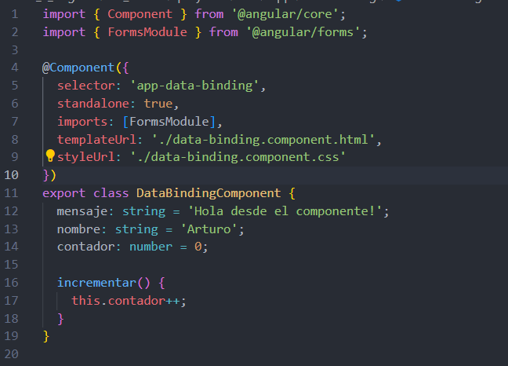
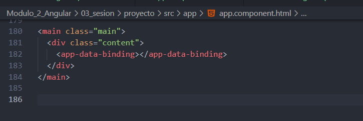
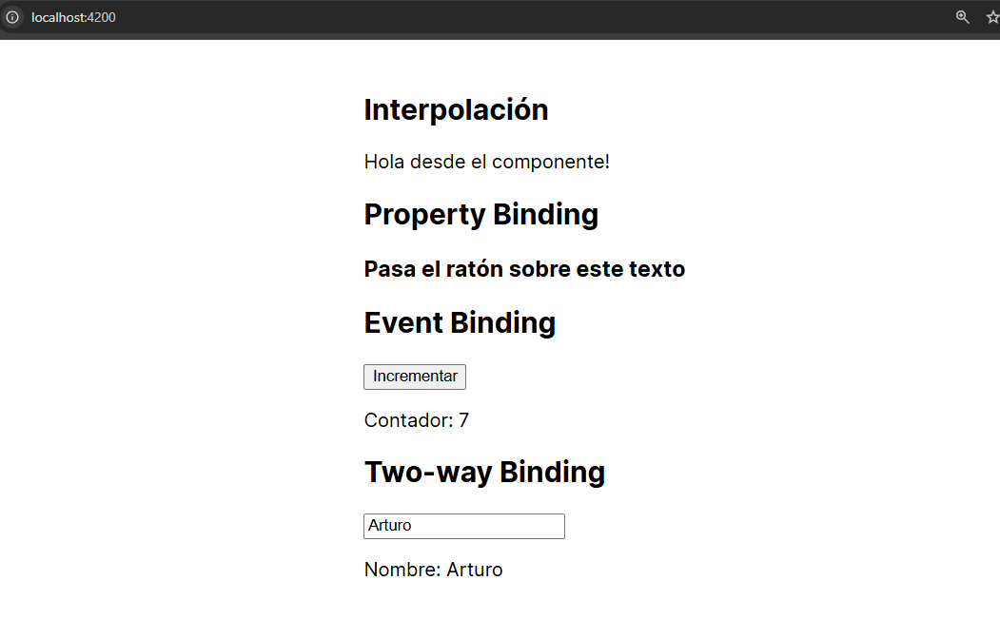

# Angular - Módulo 2

# Proyecto 

Este archivo contiene una actividad contemplando lo visto en la clase 3

## Objetivos 

- Introducción a Angular - Data Binding

## Procedimiento seguido

1. **Análisis del problema**  
   -  Tipos de Data Binding (Interpolación, Property Binding, Event Binding, Two-way Binding)

2. **Codigo**  
   -  En nuestro proyecto debemos abrir la terminal y ejecutar el siguiente comando
   ```sh
    ng generate component <nombre-componente>
   ```
   - Esto generara un nuevo componente de angular con los archivos html, css y ts listos modificarlos
   - Usaremos este componente para implementar los distintos tipos de Data Binding

3.- **Implementacion**  
   - Una vez modificado el componente que creamos lo agregamos al app.component.html
   - Iniciamos el proyecto
   ```sh
    ng serve
   ```  
   
## Problemas encontrados y soluciones implementadas

- Sin problemas

## Capturas de pantalla o diagramas relevantes

A continuación, se incluyen capturas de pantalla que ilustran el funcionamiento de las actividades

  
*Figura 1: Implementando data binding en el archivo html del componente creado .*

  
*Figura 2: Dando funcionalidad modificando el archivo ts del componente creado .*

  
*Figura 3: Implementando el componente en el app.component.html .*

  
*Figura 4: Aplicacion implementando el DataBinding .*

## Referencias o recursos utilizados

- [Binding syntax](https://v17.angular.io/guide/binding-syntax)
