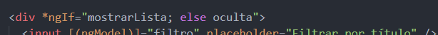
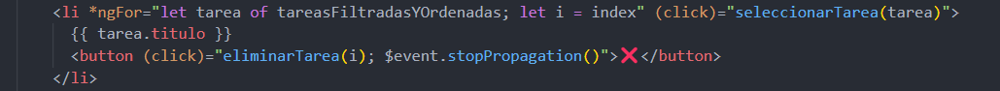
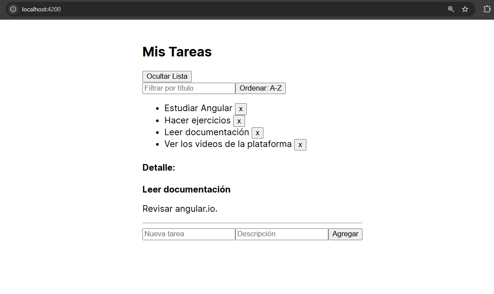

# Angular - Módulo 2

# Proyecto 

Este archivo contiene una actividad contemplando lo visto en la clase 4

## Objetivos 

- Introducción a Angular - Directivas Estructurales

## Procedimiento seguido

1. **Análisis del problema**  
   -  Directivas estructurales (NgIf, NgFor)

2. **Codigo**  
   -  En nuestro proyecto debemos abrir la terminal y ejecutar el siguiente comando
   ```sh
    ng generate component <nombre-componente>
   ```
   - Esto generara un nuevo componente de angular con los archivos html, css y ts listos modificarlos
   - Usaremos este componente para hacer una aplicacion donde hagamos uso de las directivas NgIf y NgFor

3.- **Implementacion**  
   - Realizamos un pequeño proyecto, un listado de tareas, donde podemos agregar una tarea, eliminar una tarea, ocultar el listado de tareas y al dar click sobre alguna del listado nos mostrara una descripción breve de la tarea.
   - Iniciamos el proyecto
   ```sh
    ng serve
   ```  
   
## Problemas encontrados y soluciones implementadas

- Sin problemas

## Capturas de pantalla o diagramas relevantes

A continuación, se incluyen capturas de pantalla que ilustran el funcionamiento de las actividades

  
*Figura 1: Usando NgIf para ocultar/mostrar lista.*

  
*Figura 2: NgFor para mostrar el listado de tareas.*

  
*Figura 3: Aplicacion.*

## Referencias o recursos utilizados

- [Built-in structural directives](https://angular.dev/guide/directives#built-in-structural-directives)
