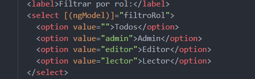
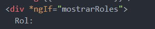
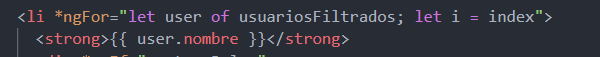
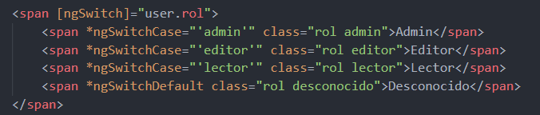
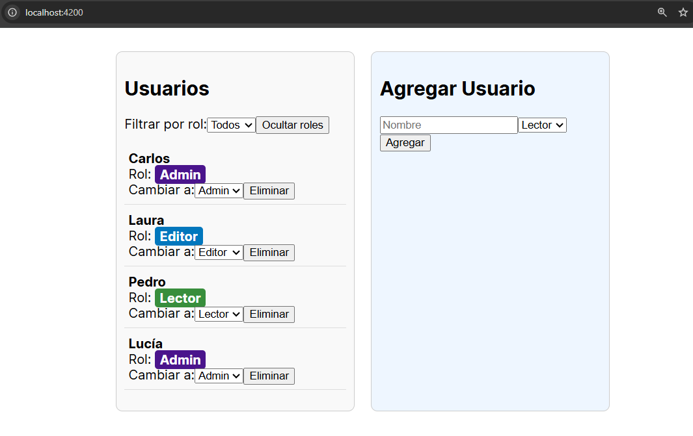
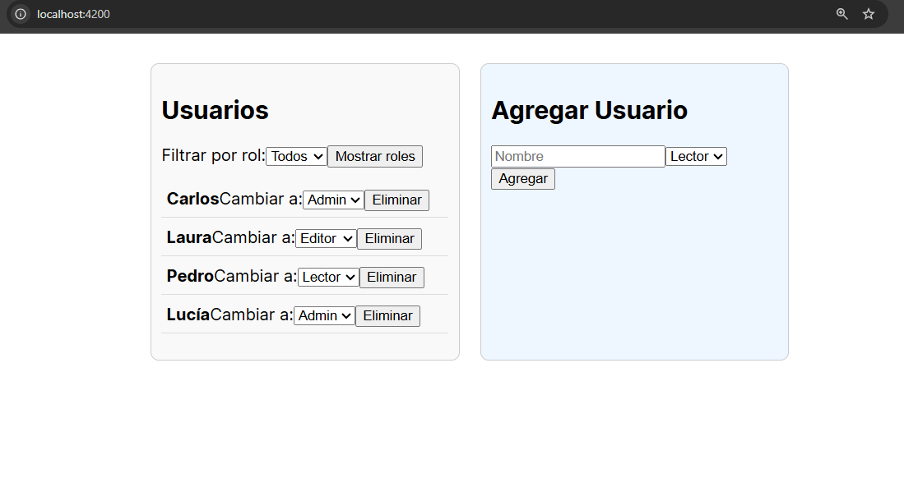
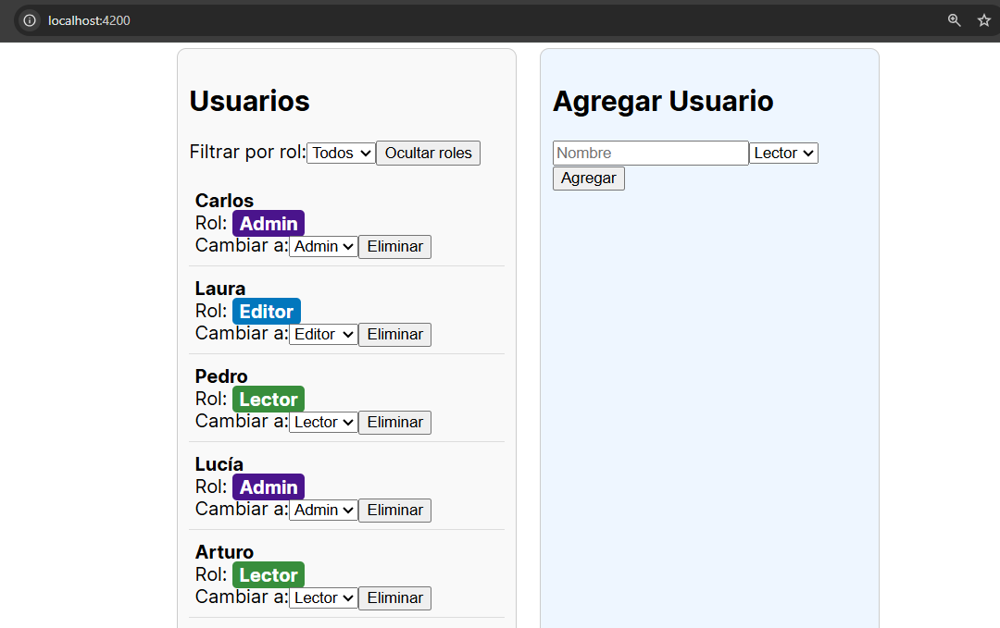
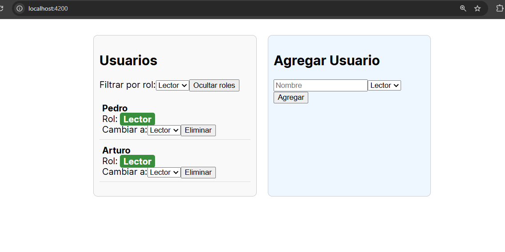

# Angular - Módulo 2

# Proyecto 

Este archivo contiene una actividad contemplando lo visto en la clase 4

## Objetivos 

- Introducción a Angular - Directivas Estructurales Parte 2

## Procedimiento seguido

1. **Análisis del problema**  
   -  Directivas estructurales (NgIf, NgFor y NgSwitch)

2. **Codigo**  
   -  En nuestro proyecto debemos abrir la terminal y ejecutar el siguiente comando
   ```sh
    ng generate component <nombre-componente>
   ```
   - Esto generara un nuevo componente de angular con los archivos html, css y ts listos modificarlos
   - Usaremos este componente para hacer una aplicacion donde hagamos uso de las directivas NgIf, NgFor y  NgSwitch

3.- **Implementacion**  
   - Realizaremos una aplicacion donde gestionemos distintos roles de usuarios, filtrar el listado por roles, agregar nuevos usuarios con su rol o cambiar el rol de algun usuario, eliminar un usuario.
   - Todo esto implementando las directivas estructurales vistas (NgIf, NgFor y NgSwitch)
   - Iniciamos el proyecto
   ```sh
    ng serve
   ```  
   
## Problemas encontrados y soluciones implementadas

- Sin problemas

## Capturas de pantalla o diagramas relevantes

A continuación, se incluyen capturas de pantalla que ilustran el funcionamiento de las actividades

  
*Figura 1: Usando ngModel.*

  
*Figura 2: ngIf para mostrar/ocultar los roles de los usuarios.*

  
*Figura 3: ngFor para mostrar el listado de usuarios.*

  
*Figura 4: ngSwitch para mostrar el rol de cada usuario y distinguirlo mediante un color especifico.*

  
*Figura 5: Vista principal de la aplicacion.*

  
*Figura 6: Interanctuando, ocultando los roles de los usuarios.*

  
*Figura 7: Agregando un usuario con su respectivo rol.*

  
*Figura 8: Filtrando usuarios por rol.*

## Referencias o recursos utilizados

- [Built-in structural directives](https://angular.dev/guide/directives#built-in-structural-directives)
