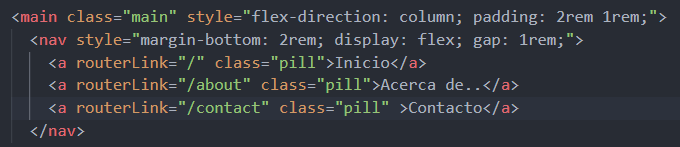
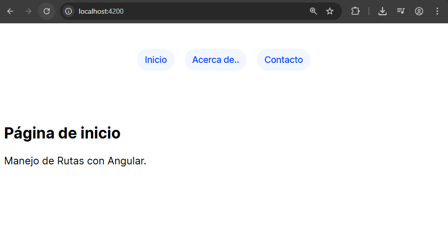
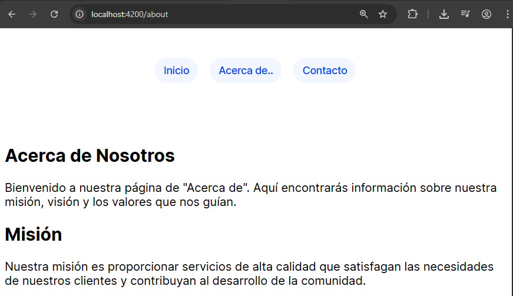
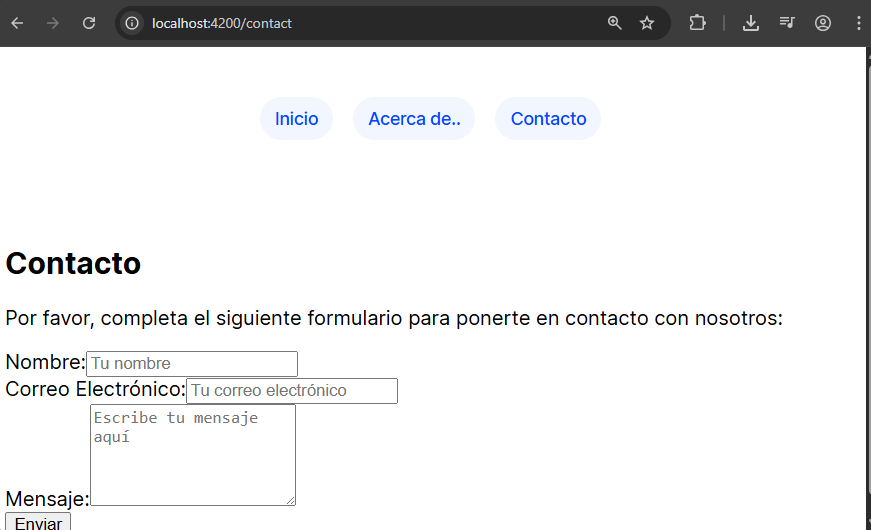

# Angular - Módulo 2

# Proyecto 

Este archivo contiene una actividad contemplando lo visto en la clase 6

## Objetivos 

- Introducción a Angular - Routing

## Procedimiento seguido

1. **Análisis del problema**  
   - Angular Router. Router permite la navegación interpretando la URL del navegador como una instrucción para cambiar de vista.

2. **Codigo**  
   -  En nuestro proyecto debemos abrir la terminal y ejecutar el siguiente comando
   ```sh
    ng generate component <nombre-componente>
   ```
   - Esto generara un nuevo componente de angular con los archivos html, css y ts listos modificarlos
   - Crearemos tres componentes, home, about y contact

3.- **Implementacion**  
   - Realizaremos una aplicacion donde hagamos uso del Routing para navegar entre distintos componentes.
   - Iniciamos el proyecto
   ```sh
    ng serve
   ```  
   
## Problemas encontrados y soluciones implementadas

- Sin problemas

## Capturas de pantalla o diagramas relevantes

A continuación, se incluyen capturas de pantalla que ilustran el funcionamiento de las actividades


*Figura: Implementando rutas.*

  
*Figura 1: Pagina principal.*

  
*Figura 2: Pagina about.*

  
*Figura 3: Pagina contact.*


## Referencias o recursos utilizados

- [Common Routing Tasks](https://angular.dev/guide/routing/common-router-tasks)
