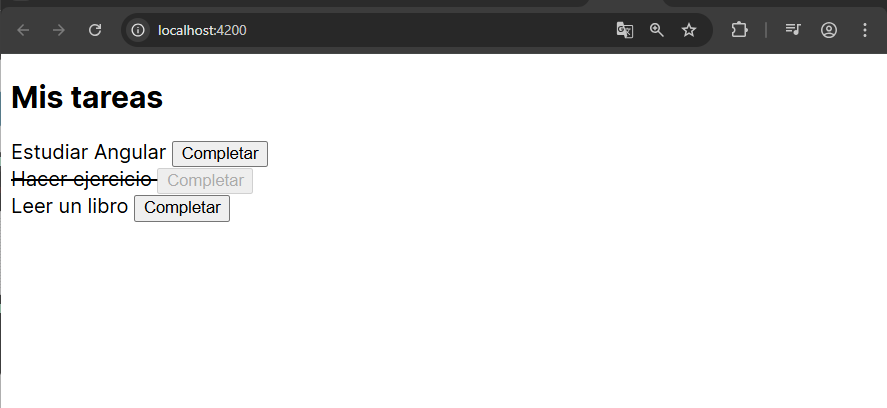
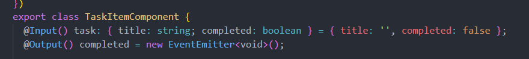

# Angular - Módulo 2

# Proyecto 

Este archivo contiene una actividad contemplando lo visto en la clase 7

## Objetivos 

- Introducción a Angular - Comunicacion entre componentes Padre-Hijo

## Procedimiento seguido

1. **Análisis del problema**  
   - Un patrón común en Angular es compartir datos entre un componente principal y uno o más componentes secundarios. Implementa este patrón con los decoradores @Input() @Output()

2. **Codigo**  
   -  En nuestro proyecto debemos abrir la terminal y ejecutar el siguiente comando
   ```sh
    ng generate component <nombre-componente>
   ```
   - Esto generara un nuevo componente de angular con los archivos html, css y ts listos modificarlos
   - Crearemos dos componentes donde implementaremos esta comunicacion entre ellos. task-list y task-item

3.- **Implementacion**  
   - Realizaremos una aplicacion sencilla de tareas donde task-list sera el componente padre e task-item el hijo
   - Creamos un metodo en el cual a partir de unas tareas ya cargadas podremos cambiarla de estados a completadas
   - Iniciamos el proyecto
   ```sh
    ng serve
   ```  
   
## Problemas encontrados y soluciones implementadas

- Sin problemas

## Capturas de pantalla o diagramas relevantes

A continuación, se incluyen capturas de pantalla que ilustran el funcionamiento de las actividades

  
*Figura 1: Aplicacion.*

  
*Figura 2: Implementando decorators Input - Output.*


## Referencias o recursos utilizados

- [Sharing data between child and parent directives and components](https://v17.angular.io/guide/inputs-outputs)
