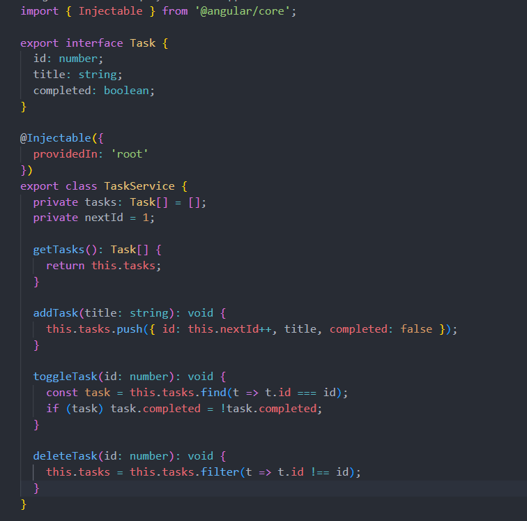
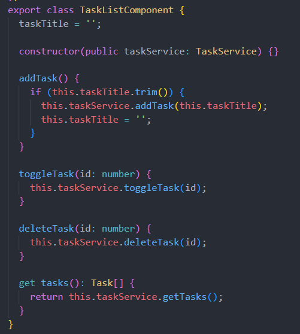
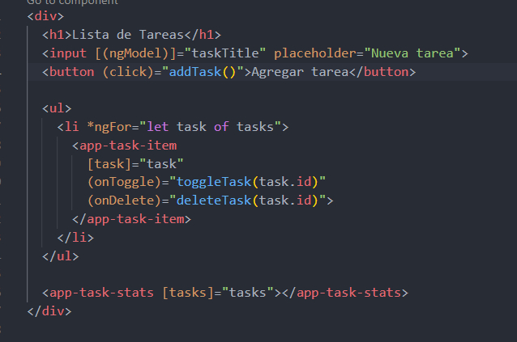

# Angular - Módulo 2

# Proyecto 

Este archivo contiene una actividad contemplando lo visto en la clase 10

## Objetivos 

- Introducción a Angular - Servicios y ciclo de vida de los componentes

## Procedimiento seguido

1. **Análisis del problema**  
   - Los servicios de Angular permiten separar los datos y las funciones de la aplicación Angular que pueden ser utilizados por varios componentes de la aplicación

2. **Codigo**  
   - Usaremos la misma aplicacion que la actividad anterior pero ahora utilizaremos un servicio
   -  En nuestro proyecto debemos abrir la terminal y ejecutar el siguiente comando
   ```sh
    ng generate service task
   ```
   - Contendra la lógica de agregar, eliminar, y obtener tareas 

3.- **Implementacion**  
   - Modificamos nuestro componente task-list para ahora usar los metodos del servicio
   - Iniciamos el proyecto
   ```sh
    ng serve
   ```  
   
## Problemas encontrados y soluciones implementadas

- Sin problemas

## Capturas de pantalla o diagramas relevantes

A continuación, se incluyen capturas de pantalla que ilustran el funcionamiento de las actividades

  
*Figura 1: Pasamos los metodos del task-list al servicio creado.*

  
*Figura 2: modificamos task-list.component.ts para ahora llamar a los metodos desde el servicio.*

  
*Figura 3: modificamos el task-list.componet.html.*


## Referencias o recursos utilizados

- [Angular services](https://angular.dev/tutorials/first-app/09-services)
