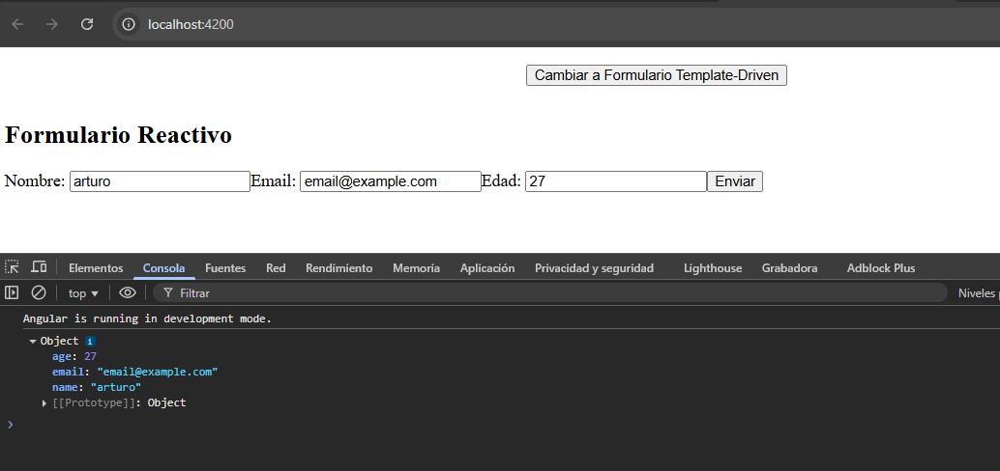
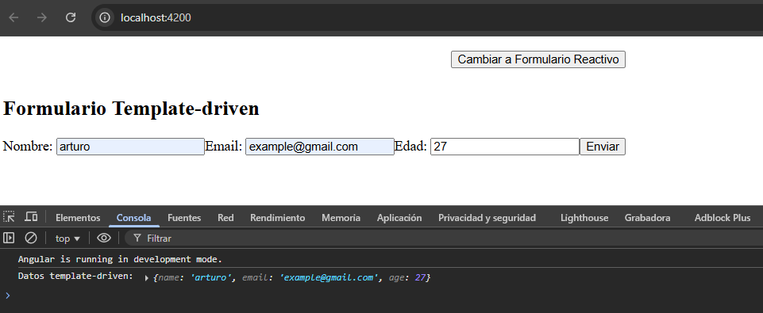

# Angular - Módulo 2

# Proyecto 

Este archivo contiene una actividad contemplando lo visto en la clase 11

## Objetivos 

- Introducción a Angular - Formularios

## Procedimiento seguido

1. **Análisis del problema**  
   - Formularios, los tipos que hay y su implementacion

2. **Codigo**  
   - Crearemos dos componentes uno para cada tipo de formulario

3.- **Implementacion**  
   - Implementamos los formularios en el proyecto
   - Iniciamos el proyecto
   ```sh
    ng serve
   ```  
   
## Problemas encontrados y soluciones implementadas

- Sin problemas

## Capturas de pantalla o diagramas relevantes

A continuación, se incluyen capturas de pantalla que ilustran el funcionamiento de las actividades

  
*Figura 1: Formulario Reactivo.*

  
*Figura 3: Formulario Template-Driven.*


## Referencias o recursos utilizados

- [Forms in Angular](https://angular.dev/guide/forms)
