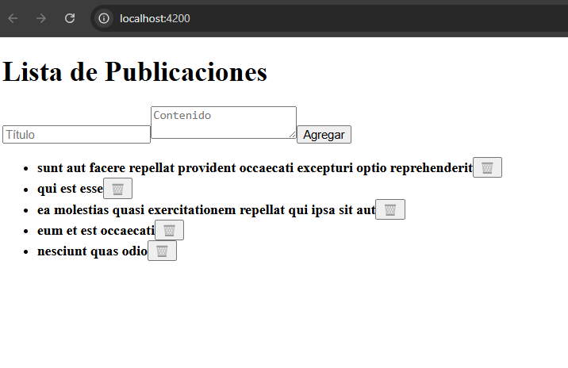
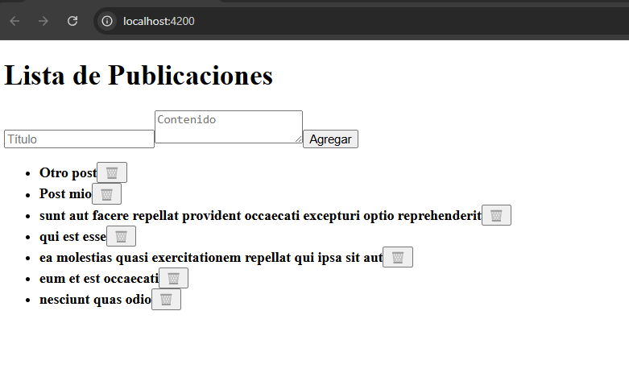
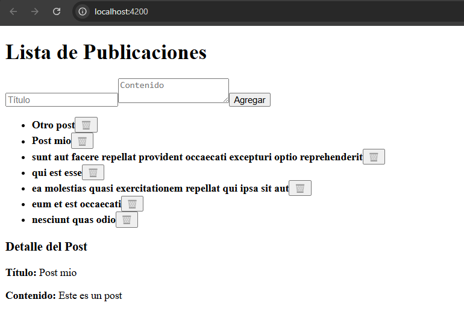
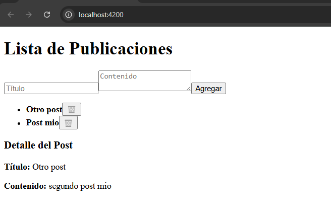

# Angular - Módulo 2

# Proyecto 

Este archivo contiene una actividad contemplando lo visto en la clase 12

## Objetivos 

- Introducción a Angular - HttpClient

## Procedimiento seguido

1. **Análisis del problema**  
   - Conocer como funciona el HttpClient

2. **Codigo**  
   - Crearemos una aplicacion utilizando el Http Client

3.- **Implementacion**  
   - Creamos un proyecto usando un API para pruebas que nos muestra un listado de publicaciones, vamos a poder agregar, visualizar y eliminar una publicación del API
   - Iniciamos el proyecto
   ```sh
    ng serve
   ```  
   
## Problemas encontrados y soluciones implementadas

- Sin problemas

## Capturas de pantalla o diagramas relevantes

A continuación, se incluyen capturas de pantalla que ilustran el funcionamiento de las actividades

  
*Figura 1: Mostramos las publicaciones del API.*

  
*Figura 2: Agregamos mas publicaciones usando el API.*

  
*Figura 3: Visualizamos una publicacion al dar click sobre ella.*

  
*Figura 4: Eliminamos publicaciones.*


## Referencias o recursos utilizados

- [Understanding communicating with backend services using HTTP](https://angular.dev/guide/http)
