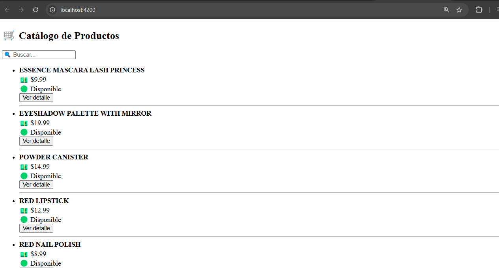
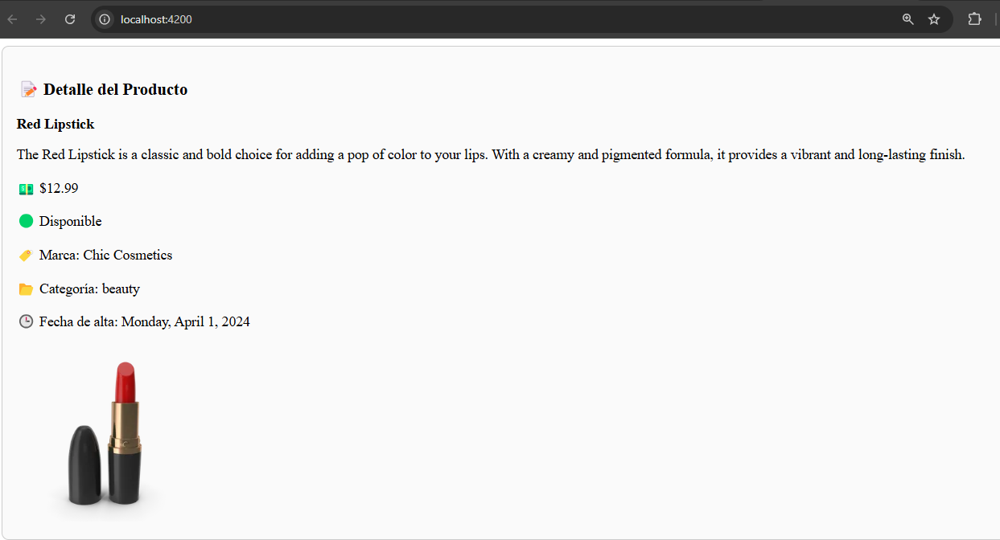
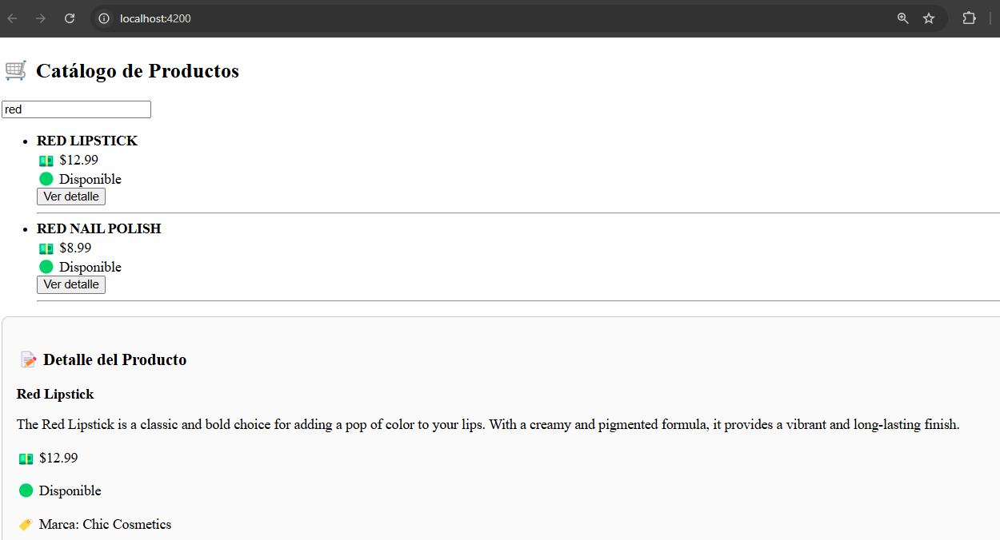

# Angular - Módulo 2

# Proyecto 

Este archivo contiene una actividad contemplando lo visto en la clase 13 y 14

## Objetivos 

- Introducción a Angular - Pipes y proyecto final

## Procedimiento seguido

1. **Análisis del problema**  
   - Implementar Pipes
   - Proyecto final aplicando todo lo aprendido

2. **Codigo**  
   - Crearemos un proyecto final utilizando todo lo aprendido durante el modulo

3.- **Implementacion**  
   - Creamos un proyecto usando un API para pruebas que nos muestra un listado de productos en el cual podemos filtrar los productos y ver los detalles al seleccionar uno
   - Usaremos Pipes
   - Iniciamos el proyecto
   ```sh
    ng serve
   ```  
   
## Problemas encontrados y soluciones implementadas

- Sin problemas

## Capturas de pantalla o diagramas relevantes

A continuación, se incluyen capturas de pantalla que ilustran el funcionamiento de las actividades

  
*Figura 1: Catalogo de productos.*

  
*Figura 2: Visualizar detalles del producto.*

  
*Figura 3: Filtrar productos.*


## Referencias o recursos utilizados

- [Pipes](https://angular.dev/guide/templates/pipes)
