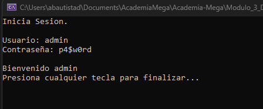

# C# - Módulo 3

# Proyecto 

Este archivo contiene una actividad contemplando lo visto en la clase 1

## Objetivos 

- Introducción a C#

## Procedimiento seguido

1. **Análisis del problema**  
   - Introducción a c#

2. **Codigo**  
   - Se creo una aplicacion de consola que valida datos de entrada con datos almacenados en un diccionario

3.- **Implementacion**
   - Se usaron metodos del lenguaje para leer los datos de entrada y validar que los datos ingresados existan en el diccionario de datos que se creo
   
## Problemas encontrados y soluciones implementadas

- Sin problemas

## Capturas de pantalla o diagramas relevantes

A continuación, se incluyen capturas de pantalla que ilustran el funcionamiento de las actividades

  
*Figura 1: Pantalla cuando se ingresan datos erroneos.*

  
*Figura 2: Pantalla cuando valida los datos.*

## Referencias o recursos utilizados

- [C#](https://dotnet.microsoft.com/es-es/languages/csharp)
