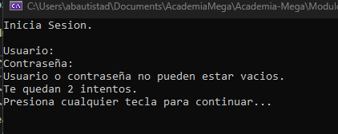
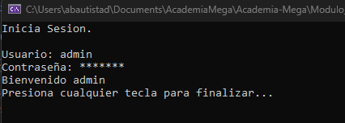

# C# - Módulo 3

# Proyecto 

Este archivo contiene una actividad contemplando lo visto en la clase 2

## Objetivos 

- Introducción a C#

## Procedimiento seguido

1. **Análisis del problema**  
   - Introducción a c#

2. **Codigo**  
   - Se creo una aplicacion de consola que valida datos de entrada con datos almacenados en un diccionario

3.- **Implementacion**
   - En esta actividad se crearon dos metodos uno para validar los datos de entrada, que estos no esten vacios y por supuesto si es que los datos introducidos se encuentran en el directorio, se agrego un conteo de intentos.
   - El otro metodo es para esconder el dato de entrada del password, asi no es visible el password en la consola
   
## Problemas encontrados y soluciones implementadas

- Sin problemas

## Capturas de pantalla o diagramas relevantes

A continuación, se incluyen capturas de pantalla que ilustran el funcionamiento de las actividades

  
*Figura 1: Validando datos de entrada vacios.*

  
*Figura 2: El dato de entrada del password esta enmascarado asi no es visible la contraseña en la consola.*

## Referencias o recursos utilizados

- [C#](https://dotnet.microsoft.com/es-es/languages/csharp)
