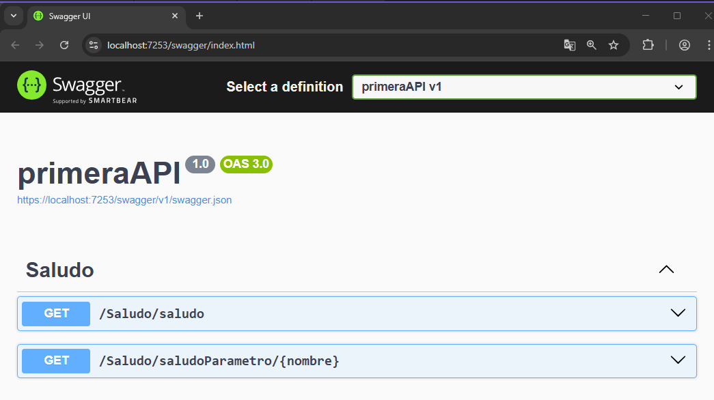
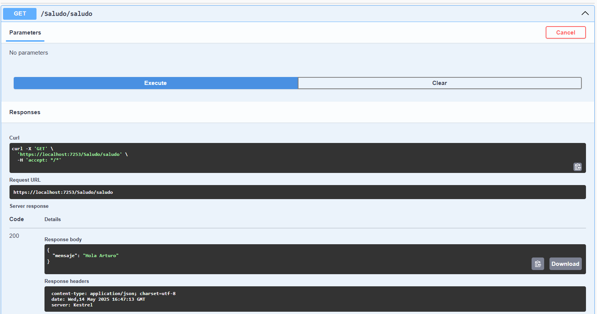
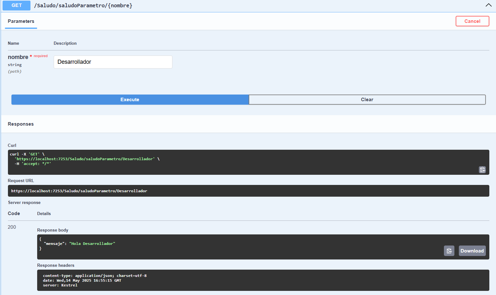

# C# - Módulo 3

# Proyecto 

Este archivo contiene una actividad contemplando lo visto en la clase 3

## Objetivos 

- Introducción a C# ASP.NET API minimas 

## Procedimiento seguido

1. **Análisis del problema**  
   - Las API mínimas son un enfoque simplificado para crear API de HTTP rápidas con ASP.NET Core

2. **Codigo**  
   - Se creo una API

3.- **Implementacion**
   - Se hicieron dos endpoint GET, uno que devuelve un json con una mensaje y otro que tambien devuelve un json con un mensaje pero este recibe un parametro
   
## Problemas encontrados y soluciones implementadas

- Sin problemas

## Capturas de pantalla o diagramas relevantes

A continuación, se incluyen capturas de pantalla que ilustran el funcionamiento de las actividades

  
*Figura 1: Swagger.*

  
*Figura 2: Probando endpoint "saludo".*

  
*Figura 3: Probando endpoint "saludoParametro".*

## Referencias o recursos utilizados

- [Introducción a las API mínimas](https://learn.microsoft.com/es-mx/aspnet/core/fundamentals/minimal-apis/overview?view=aspnetcore-9.0&WT.mc_id=dotnet-35129-website)
