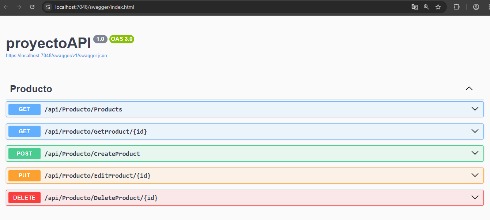
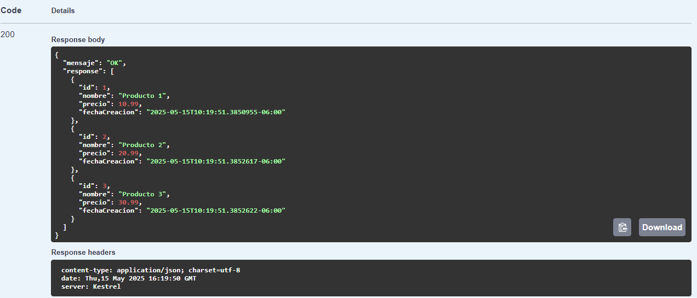
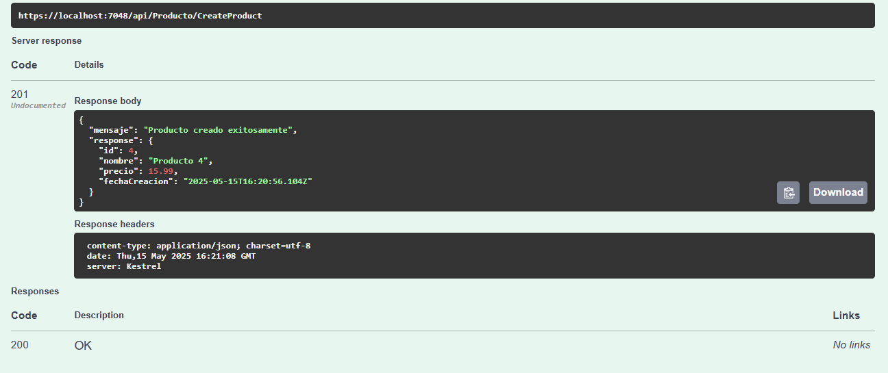
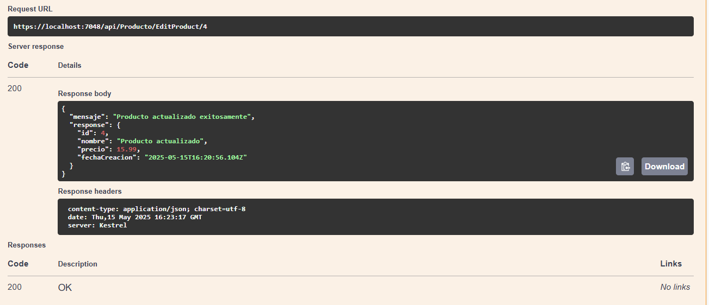
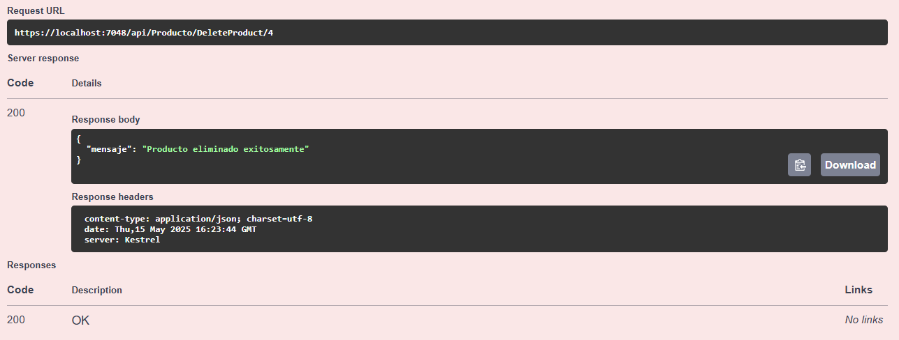

# C# - Módulo 3

# Proyecto 

Este archivo contiene una actividad contemplando lo visto en la clase 4

## Objetivos 

- Introducción a C# ASP.NET API minimas 

## Procedimiento seguido

1. **Análisis del problema**  
   - Las API mínimas son un enfoque simplificado para crear API de HTTP rápidas con ASP.NET Core, en esta ocasion se crearon los endpoints de un CRUD, listar, crear, editar, eliminar

2. **Codigo**  
   - Se creo una API con varios enpoints 

3.- **Implementacion**
   - Se hicieron 5 endpoint, uno para ver todos los productos, traer uno solo, editar uno, crear uno nuevo, eliminar uno.
   
## Problemas encontrados y soluciones implementadas

- Sin problemas

## Capturas de pantalla o diagramas relevantes

A continuación, se incluyen capturas de pantalla que ilustran el funcionamiento de las actividades

  
*Figura 1: Swagger con todos los endpoints creados.*

  
*Figura 2: Obtener todos los productos.*

  
*Figura 3: Crear un producto.*

  
*Figura 4: Actualizar un producto.*

  
*Figura 5: Eliminar un producto.*

## Referencias o recursos utilizados

- [Introducción a las API mínimas](https://learn.microsoft.com/es-mx/aspnet/core/fundamentals/minimal-apis/overview?view=aspnetcore-9.0&WT.mc_id=dotnet-35129-website)
