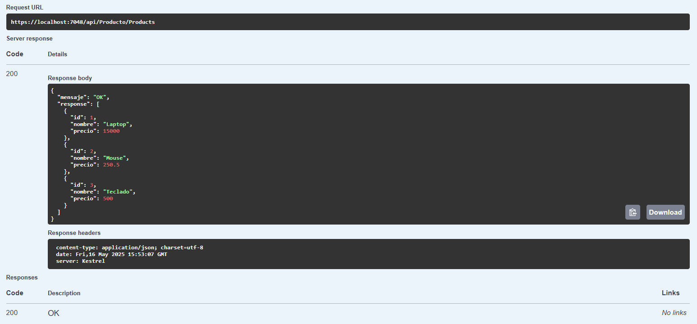
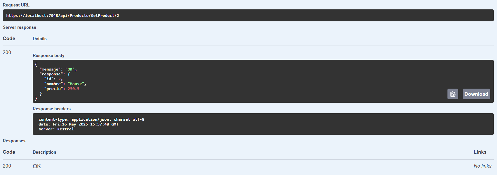
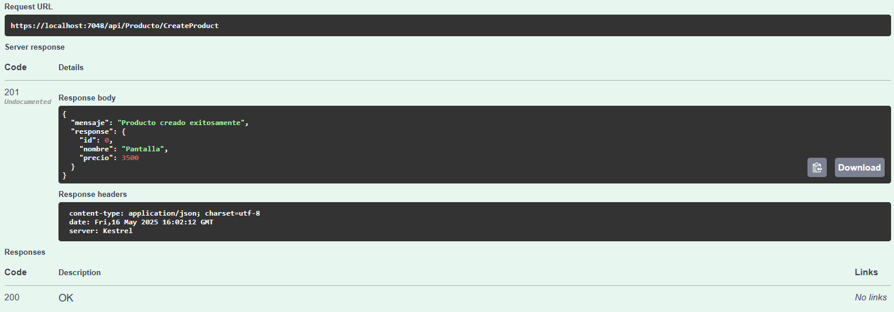
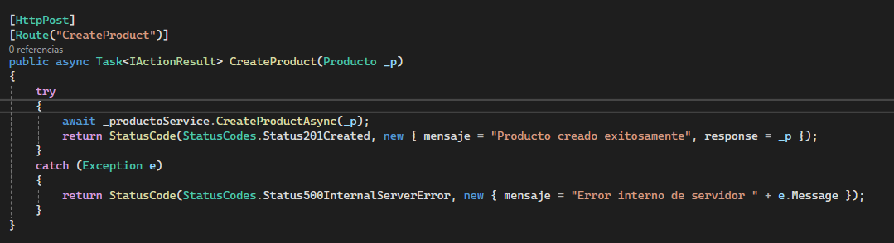
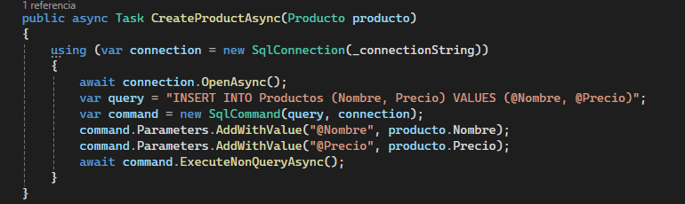

# C# - Módulo 3

# Proyecto 

Este archivo contiene una actividad contemplando lo visto en la clase 5

## Objetivos 

- Introducción a C# ASP.NET API minimas 

## Procedimiento seguido

1. **Análisis del problema**  
   - Las API mínimas son un enfoque simplificado para crear API de HTTP rápidas con ASP.NET Core, en esta ocasion se crearon los endpoints de un CRUD, listar, crear, editar, eliminar, y se implemento una conexion a una base de datos local

2. **Codigo**  
   - Se creo una API con varios enpoints, se creo un servicio el cual contiene los metodos para consultar a la base de datos.

3.- **Implementacion**
   - Se hicieron 5 endpoint, uno para ver todos los productos, traer uno solo, editar uno, crear uno nuevo, eliminar uno, esto directamente a una base de datos local
   
## Problemas encontrados y soluciones implementadas

- Sin problemas

## Capturas de pantalla o diagramas relevantes

A continuación, se incluyen capturas de pantalla que ilustran el funcionamiento de las actividades

  
*Figura 1: Obteniendo los productos desde la db.*

  
*Figura 2: Obteniendo un producto desde la db.*

  
*Figura 3: Creando un producto en la db.*

  
*Figura 4: Endpoint actualizado para ahora llamar al servicio.*

  
*Figura 5: Metodo del servicio creado para crear un registro en la db.*

## Referencias o recursos utilizados

- [Introducción a las API mínimas](https://learn.microsoft.com/es-mx/aspnet/core/fundamentals/minimal-apis/overview?view=aspnetcore-9.0&WT.mc_id=dotnet-35129-website)
