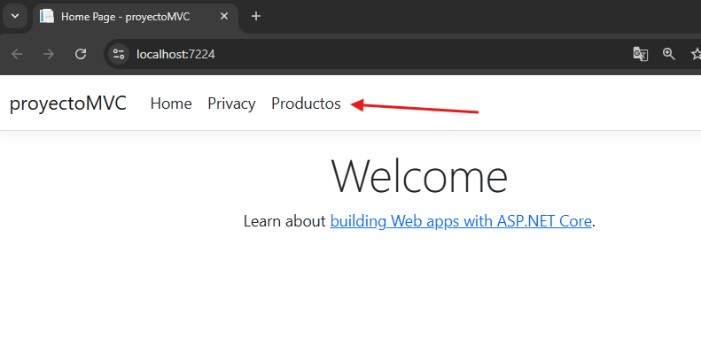
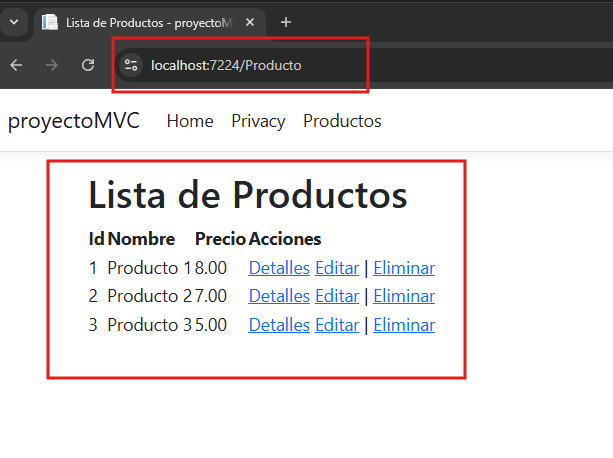
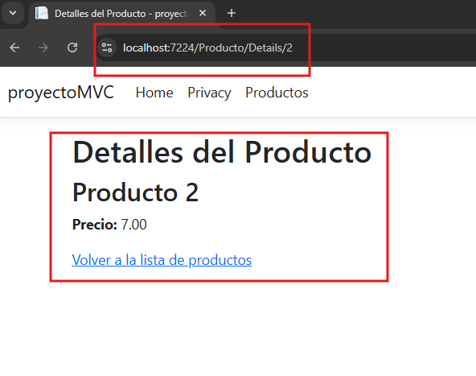

# C# - Módulo 3

# Proyecto 

Este archivo contiene una actividad contemplando lo visto en la clase 6

## Objetivos 

- Introducción a C# ASP.NET MVC

## Procedimiento seguido

1. **Análisis del problema**  
   - Desarollo de una web de ASP.NET Core MVC con controladores y vistas

2. **Codigo**  
   - Se creo el modelo productos, el controlador y dos vistas una para ver un listado de productos y otra para los detalles de cada producto
   
## Problemas encontrados y soluciones implementadas

- Sin problemas

## Capturas de pantalla o diagramas relevantes

A continuación, se incluyen capturas de pantalla que ilustran el funcionamiento de las actividades

  
*Figura 1: Aplicacion MVC.*

  
*Figura 2: Vista Productos.*

  
*Figura 3: Detalles productos.*

## Referencias o recursos utilizados

- [Introducción a ASP.NET Core MVC](https://learn.microsoft.com/es-es/aspnet/core/tutorials/first-mvc-app/start-mvc?view=aspnetcore-9.0&tabs=visual-studio)
