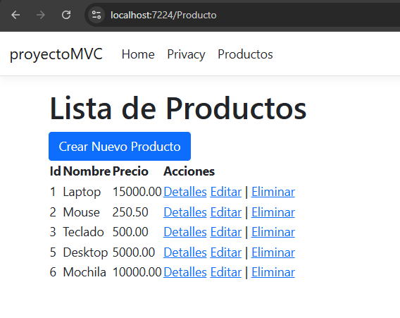

# C# - Módulo 3

# Proyecto 

Este archivo contiene una actividad contemplando lo visto en las clases 7, 8 y 9

## Objetivos 

- Introducción a C# ASP.NET MVC - Consumiendo API

## Procedimiento seguido

1. **Análisis del problema**  
   - Desarollo de una web de ASP.NET Core MVC con controladores y vistas
   - Consume el API creada en actividades pasadas

2. **Codigo**  
   - Se creo todo el CRUD para el manejo de los productos de la aplicacion
   - Estos consumen el API que se creo anteriormente   
## Problemas encontrados y soluciones implementadas

- Sin problemas

## Capturas de pantalla o diagramas relevantes

A continuación, se incluyen capturas de pantalla que ilustran el funcionamiento de las actividades

  
*Figura 1: Aplicacion MVC Listado de productos.*

  
*Figura 2: Vista Crear Producto.*

  
*Figura 3: Detalles productos.*

  
*Figura 4: Editar producto.*

  
*Figura 5: Eliminar producto.*

## Referencias o recursos utilizados

- [Introducción a ASP.NET Core MVC](https://learn.microsoft.com/es-es/aspnet/core/tutorials/first-mvc-app/start-mvc?view=aspnetcore-9.0&tabs=visual-studio)
