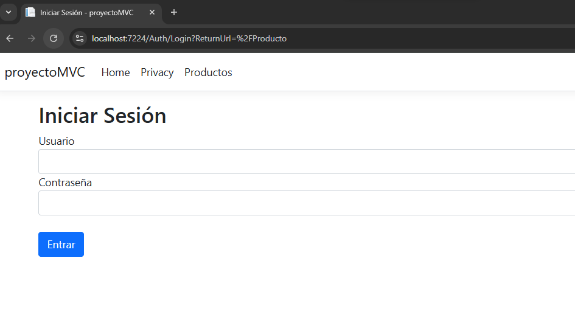
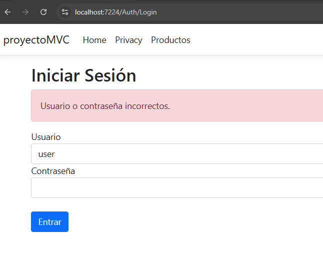

# C# - Módulo 3

# Proyecto 

Este archivo contiene una actividad contemplando lo visto en las clase 10

## Objetivos 

- Introducción a C# ASP.NET MVC - Consumiendo API -Uso de un login

## Procedimiento seguido

1. **Análisis del problema**  
   - Implementando un login para el acceso y autorizacion a los datos

2. **Codigo**  
   - Se creo todo el CRUD para el manejo de los productos de la aplicacion
   - Estos consumen el API que se creo anteriormente   
   - Se agrega el login
## Problemas encontrados y soluciones implementadas

- Sin problemas

## Capturas de pantalla o diagramas relevantes

A continuación, se incluyen capturas de pantalla que ilustran el funcionamiento de las actividades

  
*Figura 1: Login para acceso a la informacion.*

  
*Figura 2: Credenciales no validas.*

## Referencias o recursos utilizados

- [Introducción a ASP.NET Core MVC](https://learn.microsoft.com/es-es/aspnet/core/tutorials/first-mvc-app/start-mvc?view=aspnetcore-9.0&tabs=visual-studio)
