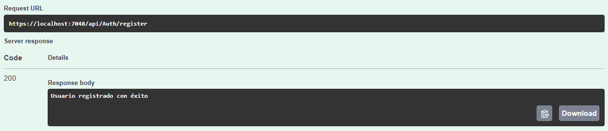
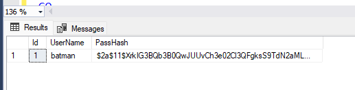
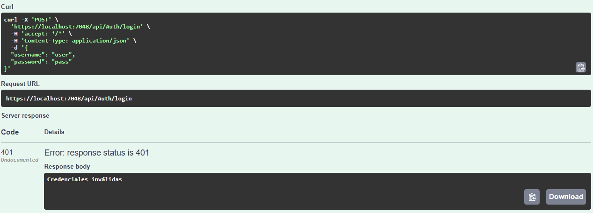
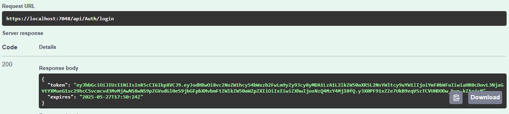
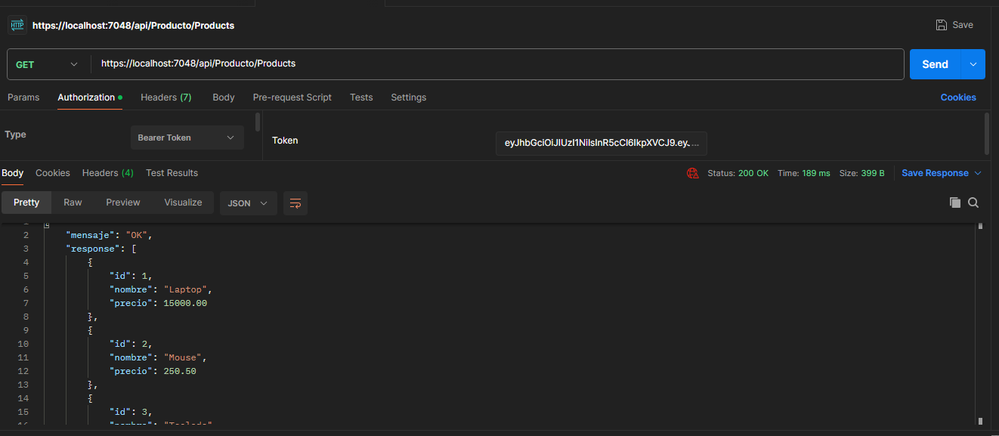

# C# - Módulo 3

# Proyecto 

Este archivo contiene una actividad contemplando lo visto en las clase 11

## Objetivos 

- Aplicar JWT a API

## Procedimiento seguido

1. **Análisis del problema**  
   - usar autentificacion para acceder a los datos del API

2. **Codigo**  
   - Se agrega JWT para generar un token para autentificar el acceso a los endpoints del API
## Problemas encontrados y soluciones implementadas

- Sin problemas

## Capturas de pantalla o diagramas relevantes

A continuación, se incluyen capturas de pantalla que ilustran el funcionamiento de las actividades

  
*Figura 1: Registramos un usuario.*

  
*Figura 2: Usuario creado en DB.*

  
*Figura 3: Credenciales no validas.*

  
*Figura 4: Token generado al ingresar con un usuario valido.*

  
*Figura 5: Pasamos el token al consultar el enpoint para tener acceso a la información.*

## Referencias o recursos utilizados

- [Introducción a ASP.NET Core MVC](https://learn.microsoft.com/es-es/aspnet/core/tutorials/first-mvc-app/start-mvc?view=aspnetcore-9.0&tabs=visual-studio)
