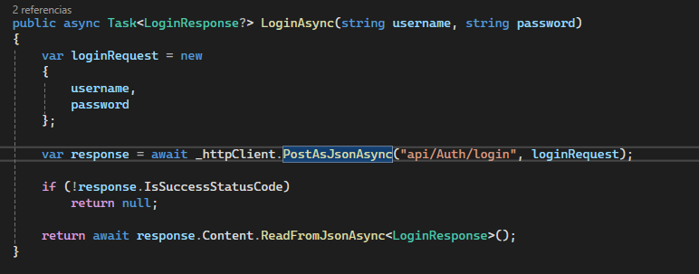
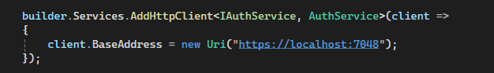
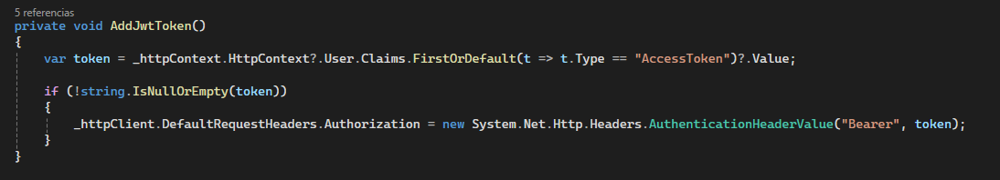
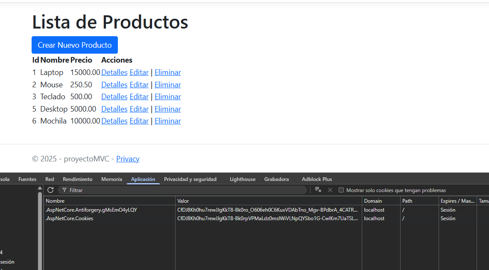

# C# - Módulo 3

# Proyecto 

Este archivo contiene una actividad contemplando lo visto en las clase 12

## Objetivos 

- Implementar endpoints de login en proyecto MVC

## Procedimiento seguido

1. **Análisis del problema**  
   - Autenticarnos desde el proyecto MVC para acceder a los datos

2. **Codigo**  
   - Se agrega JWT para generar un token para autentificar el acceso a los endpoints del API mediante el proyecto MVC
## Problemas encontrados y soluciones implementadas

- Sin problemas

## Capturas de pantalla o diagramas relevantes

A continuación, se incluyen capturas de pantalla que ilustran el funcionamiento de las actividades

  
*Figura 1: Funcion Login en proyecto MVC.*

  
*Figura 2: Implementación de servicio.*

  
*Figura 3: Funcion que recupera el token de la sesión.*

  
*Figura 4: Acceso a los datos usando el token de sesion.*

## Referencias o recursos utilizados

- [Introducción a ASP.NET Core MVC](https://learn.microsoft.com/es-es/aspnet/core/tutorials/first-mvc-app/start-mvc?view=aspnetcore-9.0&tabs=visual-studio)
