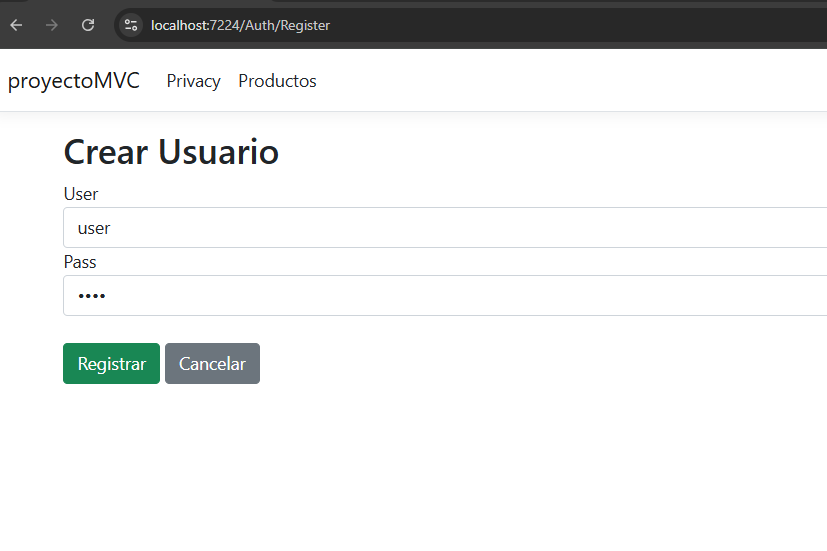
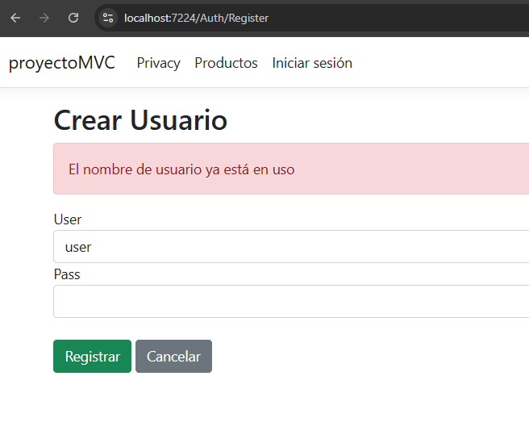

# C# - Módulo 3

# Proyecto 

Este archivo contiene una actividad contemplando lo visto en las clase 13

## Objetivos 

- Crear usuario en proyecto MVC

## Procedimiento seguido

1. **Análisis del problema**  
   - Crear un usuario desde el proyecto MVC para acceder a los datos

2. **Codigo**  
   - Se modifico el controlador para agregar las funciones para poder registrar un usuario y acceder a las vistas protegidas de la aplicacion
## Problemas encontrados y soluciones implementadas

- Sin problemas

## Capturas de pantalla o diagramas relevantes

A continuación, se incluyen capturas de pantalla que ilustran el funcionamiento de las actividades

  
*Figura 1: Creando usuario.*

  
*Figura 2: Si un nombre de usuario ya existe.*

## Referencias o recursos utilizados

- [Introducción a ASP.NET Core MVC](https://learn.microsoft.com/es-es/aspnet/core/tutorials/first-mvc-app/start-mvc?view=aspnetcore-9.0&tabs=visual-studio)
