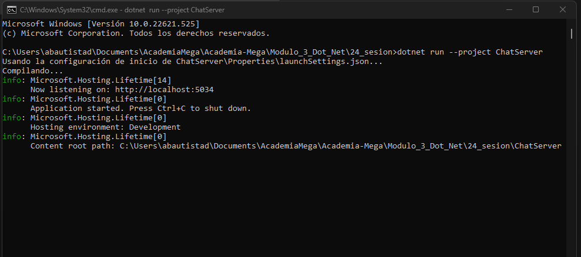
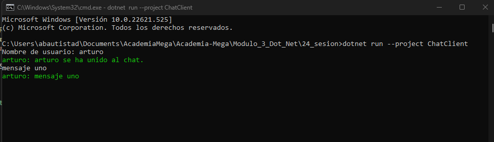
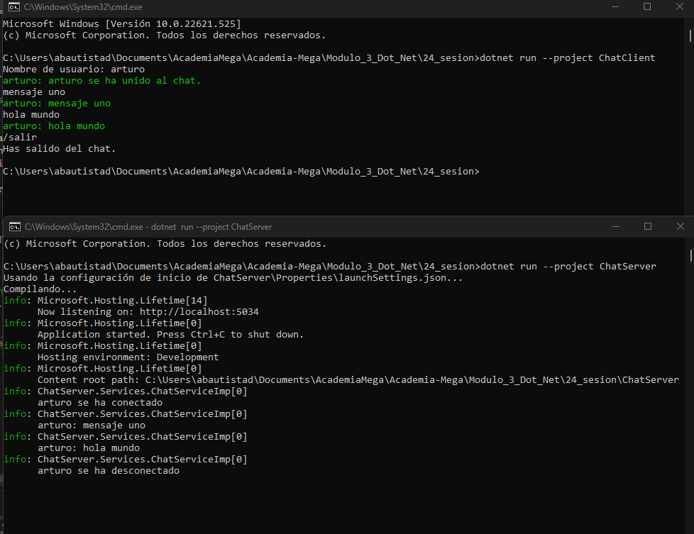

# C# - Módulo 3

# Proyecto 

Este archivo contiene una actividad contemplando lo visto en las clase 23 y 24

## Objetivos 

- Servicio gRPC

## Procedimiento seguido

1. **Análisis del problema**  
   - Utilizar gRPC (Google Remote Procedure Calls), que es una tecnología moderna de comunicación entre aplicaciones.

2. **Codigo**  
   - Se creo tanto el servidor como el cliente
## Problemas encontrados y soluciones implementadas

- Sin problemas

## Capturas de pantalla o diagramas relevantes

A continuación, se incluyen capturas de pantalla que ilustran el funcionamiento de las actividades

  
*Figura 1: Ejecutando servidor.*

  
*Figura 2: Ejecutando cliente y testeando entradas de texto.*

  
*Figura 3: Se observa comunicacion entre cliente - servidor.*

## Referencias o recursos utilizados

- [Servicios gRPC con C#](https://learn.microsoft.com/es-es/aspnet/core/grpc/basics?view=aspnetcore-8.0)
