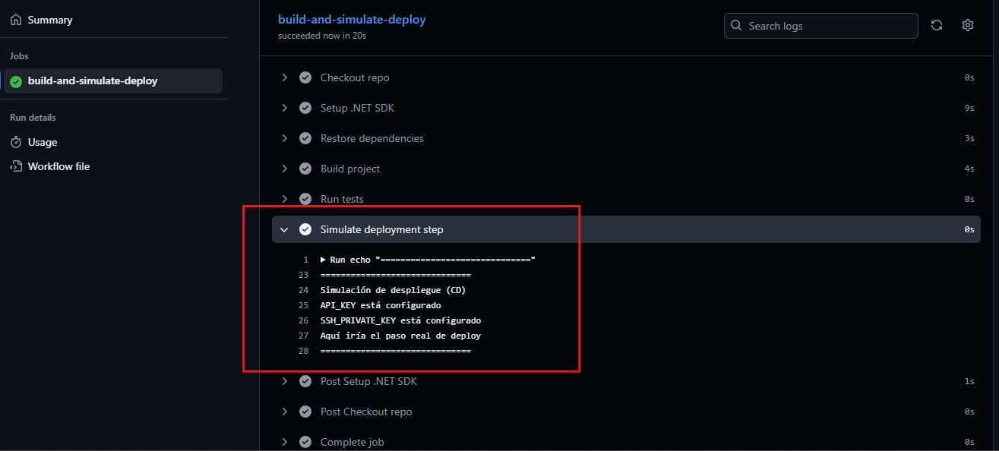

# C# - Módulo 3

# Proyecto 

Este archivo contiene una actividad contemplando lo visto en las clase 25 y 26

## Objetivos 

- Manejo de Integración Continua (CI) y Despliegue Continuo (CD).

## Procedimiento seguido

1. **Análisis del problema**  
   - Se crea proyecto para implementar CI/CD integrado desde Github usando una API basic

2. **Codigo**  
   - Se creo el proyecto de un API basica, el archivo yml con la implementacion de los secrect, se realizaron los pasos en github para realizar los actions
## Problemas encontrados y soluciones implementadas

- Sin problemas

## Capturas de pantalla o diagramas relevantes

A continuación, se incluyen capturas de pantalla que ilustran el funcionamiento de las actividades

  
*Figura 1: Archivo yml.*

  
*Figura 2: Ejecucion en ACTIONS del flujo cuando se da push al proyecto.*

  
*Figura 3: Todo OK.*

  
*Figura 4 Build OK.*

  
*Figura 5 Agregando secrets.*

  
*Figura 6 Modificamos el yml para leer los secrets y al dar push se vuelve a ejecutar todo el build.*

  
*Figura 7 Todo OK.*

  
*Figura 8 Aqui se aprecia que leyo los secrets correctamente.*

## Referencias o recursos utilizados

- [Documentación oficial GitHub Actions](https://docs.github.com/en/actions)
- [Guía para crear workflows](https://docs.github.com/en/actions/using-workflows)
- [Cómo usar Secrets en GitHub Actions](https://docs.github.com/en/actions/security-guides/encrypted-secrets)
- [Ejemplos de workflows para .NET](https://github.com/actions/setup-dotnet)
