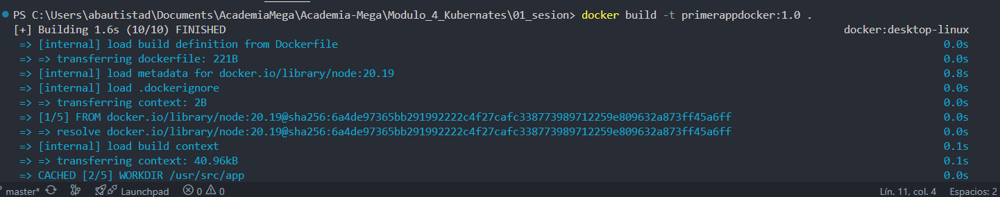
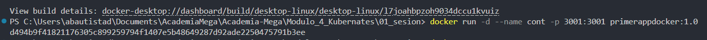
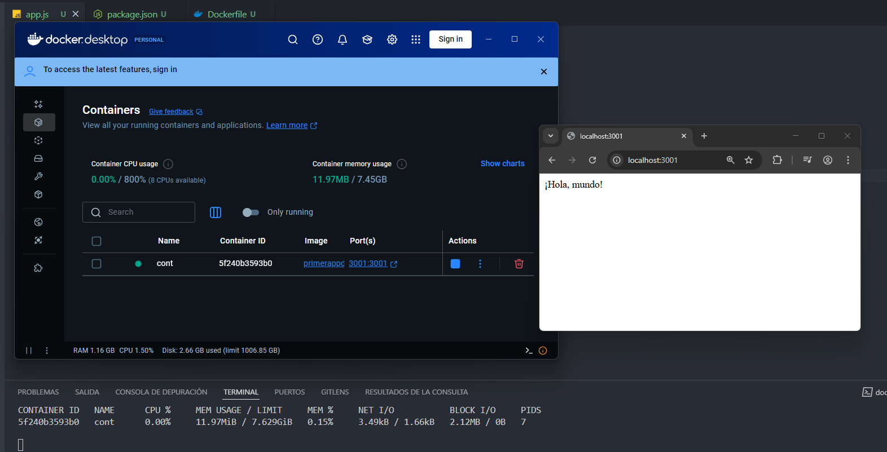

# Kubernates - Módulo 4

# Proyecto 

Este archivo contiene una actividad contemplando lo visto en la clase 2

## Objetivos 

- Crear un contenedor

## Procedimiento seguido

1. **Análisis del problema**  
   - Se creo un contenedor usando un Dockerfile

2. **Codigo**  
   - Se creo una aplicacion para ejecutarse en un contenedor

3.- **Implementacion**
   - Se usaron los siguientes comandos

   docker build -t primerappdocker:1.0 .

   docker run -d --name cont -p 3001:3001 primerappdocker:1.0  

## Problemas encontrados y soluciones implementadas

- Sin problemas

## Capturas de pantalla o diagramas relevantes

A continuación, se incluyen capturas de pantalla que ilustran el funcionamiento de las actividades

  
*Figura 1: Construyendo imagen.*

  
*Figura 2: Ejecutar contenedor.*

  
*Figura 3: Aplicacion ejecutando en contenedor.*

## Referencias o recursos utilizados

- [dockerdocs](https://docs.docker.com/)
